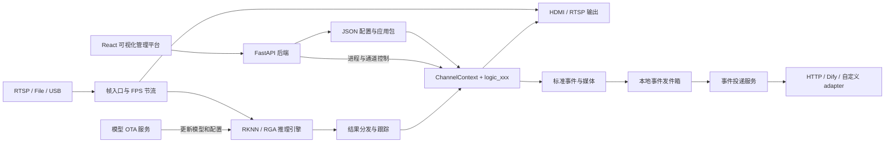

# RK3588 可扩展多路视觉分析引擎与管理平台

> 当前开发、配置和运维契约以 [docs 文档入口](docs/README.md) 为准；该入口已按提交
> `6bd2b94dbbdd8787753b90d1527a6882e3a70aa2`（2026-08-23）核对，并同时面向大模型与二次开发者。

本项目是一个运行于 RK3588 边缘设备的可扩展多路视觉分析引擎并配备可视化的web程序管理界面，具有多路视频采集、RKNN 推理、目标跟踪、利用推理结果进行自定义的算法编排等功能。主要解决了过去视觉算法开发中遇到的如下问题：
- 多路视频流在性能受限的边缘端难以同时进行高性能的采集和分析。
- 算法复用性和可拓展性差，过去的算法中视频流和逻辑是绑定的，若要改变某个视频通道的逻辑需要将前一个逻辑删除，若算法耦合性高，则改动较大。但利用本项目的低耦合设计可将任意算法逻辑绑定至任意视频源类型（RTSP，USB，视频文件）的任意视频通道。
- 视觉算法逻辑的编写没有一个统一的规则来约束开发者，进而导致代码可读性差，维护难度高。本项目将编写视觉算法常用的变量，如模型推理结果，视频帧，时间戳等变量都封装至一个上下文结构体ChannelContext中供开发者调用。
- 视觉算法逻辑编写的时候常与底层逻辑（如视频解码，线程调度等）进行交互，导致开发难度高。开发者利用本项目中引擎的低耦合设计来实现视频流分析的时候则只需关注算法逻辑的实现，无需关注底层的设计。
- 项目维护难，以前修改某个算法参数需要改配置文件的内容，然后重新编译程序。流程繁琐，本项目配有web管理界面，程序的参数可在界面上直接修改。
- 算法启动流程复杂，本项目配备的可视化界面便于开发者或运维人员将算法应用至选定的视频流，并且能够设定服务器上报之类的与后端通信的相关配置。
- 调试困难，以前调试视觉算法的时候只能板端接显示屏，远程调试的时候则无法看见画面。本项目配备的web管理界面可观看程序的实时画面输出，并在界面侧边栏显示程序的终端输出。  

项目仓库配有演示基本功能的demo便于二次开发者了解利用引擎基本功能构建自己视觉分析应用的过程。    
> 若第一次接触本项目, 强烈建议通过教程的程序实例来初步理解视觉程序的构建方式。   

如果希望由大模型从需求访谈一直完成到代码和验证，请先安装并登录 Codex CLI 或 Claude Code，然后在
仓库根目录运行：

```bash
./develop_feature
```

原生 Windows 使用 `develop_feature.cmd` 或 `py .\develop_feature`。启动器只支持 Codex CLI 与 Claude
Code；直接下载并解压项目 ZIP 也可运行，不要求 `.git` 目录或 Git 命令。仅检测到一个代理时直接使用，
两个都可用时先让用户选择，也可通过 `--agent codex` 或
`--agent claude` 指定。随后自动检测当前系统、WSL、架构、RK3588 设备树和关键工具；第一题确认开发
宿主及默认 RK3588 部署目标，用户通常只需回答“是”，不正确时回答“否 + 简短纠正”。业务需求通常
只问 2–3 轮、最多 4 轮；向导先核对源码，再把相关细节合成具体方案供用户用“是/否”确认，不会逐项
盘问硬件和合同字段。需求完整后只生成通道/全局 Logic：代理在一次性隔离副本中自动执行，原仓库只允许
回写 `vision_analysis/src/logic/modules/**` 和 `vision_analysis/src/logic/global_modules/**`；回写由文件
内容快照和 SHA-256 校验保护，任何其他改动
都会让整批结果被拒绝，
且不需要手动运行 `/permissions`。需要 Web、服务、配置或引擎改动的需求只报告边界，不会实施。
`--confirm-before-code` 会在写代码前等待确认，`--plan-only` 只生成合同和计划，`--check` 检查两个
代理及 Skill 是否可用。适配边界见
[Codex 与 Claude Code 适配](docs/skills/rk3588-feature-wizard/references/agent-adapters.md)。

第一次开发报警、图片/视频或 HTTP/Dify 上报功能，请从
[事件与上报开发](docs/skills/rk3588-console-ops/references/event-reporting.md) 开始；可直接交给大模型的
任务模板见[提示词模板](docs/skills/build-rk3588-vision-app/references/prompt-recipes.md)。

事件投递采用“Logic 字段声明 + 随程序包发布的接口契约 + 应用级连接 + 版本化投递绑定”模型。
算法 Logic 只产生标准事件和动态 `fields`；远端字段名、媒体、请求格式和成功条件由 Logic 目录的
`report_templates/` 声明并在打包时统一聚合；地址、密钥和 Header 保存到当前应用的持久化连接中。
画布固定契约 revision，因此积压事件不会因后来修改模板而改变请求语义。只有接入全新交互协议
或签名算法时才需要新增 Adapter，不应修改算法 Logic 或 C++ 事件核心。

项目由三层组成：

- **视觉分析运行引擎**：C++ 实现的多路视频采集、推理、跟踪、业务逻辑和输出管线；
- **程序管理平台**：React + FastAPI 实现的可视化配置、程序管理、实时画面、日志、记录、终端和服务控制；
- **业务应用**：通过 `logic_xxx` 模块和 JSON 配置构建的具体分析方案。

> 本项目不是通用的任意DAG（有向无环图）工作流引擎。Web 画布用于编排视频源、模型、ROI、业务逻辑和上报等固定角色，运行时将其转换为稳定的多通道分析管线。
  
本项目受到 GNU 计划与自由软件运动的启发，并向所有长期致力于软件自由、知识共享与技术公共化的开发者致敬。如果本项目对你有所帮助，欢迎为仓库点亮一颗⭐。这不仅是对项目的认可，也能帮助更多开发者发现、使用和推广这个项目。我们相信，软件不应只是封闭的工具，也应当成为可以被学习、理解、改进和传播的公共知识。开放源代码的意义，不仅在于可以让任何人出于任何目的使用，修改，发布软件，更在于让技术成果能够接受时间检验、持续演进，并服务更多的人。本项目希望在嵌入式视觉、边缘计算与人工智能应用领域，尽可能提供清晰、透明且可复现的实现，使开发者能够自由地研究代码、改进功能，并将有价值的成果继续传递下去。  

对于本项目中的多路视觉推理引擎的设计，作者认为是目前RK3588上设计多路视觉算法的最优解，相关的设计理念也可以推广到其他载板的需要执行多路视频流，多种视觉算法逻辑的边缘设备上。 

如有任何疑问或建议，欢迎随时联系作者Sunny_Wei。Email：1927096839@qq.com。  
祝朋友们编程愉快！ Happy coding :-)

## 核心能力

### 视频推理能力

- RTSP、视频文件和 USB 摄像头输入；
- 最多 15 个稳定通道 ID；
- YOLOv5 检测、YOLOv8 检测、YOLOv8-Pose、YOLOv5-Seg；
- 单通道多模型组合推理，结果按同一帧合并；
- RKNN NPU 多核心分配、RGA 图像转换和 DMA-BUF 零拷贝优先路径
- 充分压榨npu算力，可以实现多路推理时npu的3个核心占用率均在95%以上
- 每通道独立 FPS、模型阈值、类别过滤和跟踪参数；任务队列深度当前来自全局 `queue_size`；
- SORT风格目标跟踪及稳定 `track_id`；
- 推理通道和无模型传统 CV 通道可同时运行。

### 业务逻辑灵活拓展能力

- 每种业务逻辑位于独立的 `src/logic/modules/logic_xxx/` 目录；
- 通过 `REGISTER_LOGIC(logic_xxx)` 自动注册，无需修改中央分发表；
- `ChannelContext` 提供帧、推理结果、ROI、时间、状态、参数、绘制和跨通道快照；
- `logic.json` 统一声明模块参数、Web 动作、上报字段及热重载策略；
- 每通道拥有独立的 `ctx->state`，同一逻辑可安全复用于多个通道；
- 支持业务按钮动作、系统级动作和跨通道全局逻辑。
- 任意逻辑与任意视频通道可自由组合。
- 新增逻辑时无需变动旧的逻辑的相关代码，且上层通道逻辑与底层（线程调度，视频解码等模块）解耦。

### 显示、录像与事件投递

- HDMI/GTK 窗格显示；
- 内置 RTSP 服务，可流式输出与本地显示一致的拼接画面；
- ROI、检测框、姿态、分割和自定义绘制统一渲染；
- 带标注图片、原始图片与事件视频（`none` 保持源分辨率，`custom`/`all` 按实时显示窗格渲染）；
- 事件前后视频环形缓冲和异步 MP4 编码；
- 本地持久化事件发件箱，断网时保留并自动重试；
- `http` 与 `dify_workflow` Adapter，支持可复用接口契约、图片、视频和纯数据事件；
- Web 请求预览、本地事件测试发送与可扩展 adapter catalog；
- 每个 delivery 独立维护上传状态，全部成功后自动删除本地事件。

### Web 管理平台

- 可视化编排视频源、模型、ROI、业务逻辑、参数和上报策略；
- 应用包上传、安装、启动、停止和状态查看；
- 支持选择不同配置文件启动；
- 实时画面、运行日志和待上报记录查看；
- Web 按钮向指定通道业务逻辑发送动作（需自行编写按钮的功能）
- 浏览器终端、板级后台服务管理，以及当前应用独立的投递连接、接口契约和 OTA 配置；
- 配置保存后由 C++ 运行时自动检测并热更新。

## 系统架构



### 单帧运行链路

```text
GStreamer appsink
  → pipeline_submit_frame()
  ├─ 按录像自身 FPS → 事件视频源帧缓存
  └─ 每通道业务 max_fps 节流
       ├─ 无推理通道：按需惰性取帧 → 同步执行传统 CV logic
       ├─ 最新源帧 → HDMI/有客户端的 RTSP 预览队列
       └─ 推理通道：任务队列 → RKNN worker → 同帧结果分发
       → tracker
       → 构造 ChannelContext
       → 执行动作处理器
       → 执行当前 logic_xxx
       → 原子写回 frame / results / state / draw commands
       → 显示叠加、事件图片和跨通道快照
```

业务发布与事件图片通过版本检查保持帧/结果一致；事件视频走独立源帧环形缓冲；实时预览优先显示
最新解码帧，并使用最近结果进行叠加，以降低观看延迟。

## 仓库结构

```text
.
├── vision_analysis/             # C++ 视觉分析运行引擎与默认应用
│   ├── assets/                  # RKNN 模型、标签和示例配置
│   ├── scripts/                 # logic 清单生成与一致性校验
│   ├── src/
│   │   ├── capturer/            # GStreamer RTSP/File/USB 采集与重连
│   │   ├── pipeline/            # 帧入口、结果分发与业务调用
│   │   ├── inference/           # 推理任务、模型实例与热换
│   │   ├── tracking/            # 每通道目标跟踪
│   │   ├── logic/core/          # ChannelContext、注册表、参数和全局逻辑
│   │   ├── logic/modules/       # 可扩展业务逻辑模块
│   │   ├── logic/global_modules/ # 可扩展全局逻辑模块
│   │   ├── display/             # HDMI 显示与统一叠加
│   │   ├── rtsp/                # 拼接画面 RTSP 输出
│   │   ├── event/               # 标准事件与媒体发件箱生产端
│   │   ├── recorder/            # 事件前后视频
│   │   ├── control/             # Web/外部通道动作控制
│   │   ├── config/              # 配置解析、校验和热重载字段
│   │   ├── runtime/             # APP_CTRL、快照与运行状态
│   │   └── yolo/                # RKNN 模型实现与后处理
│   ├── CMakeLists.txt
│   └── build.sh                 # 编译、打包和运行脚本生成
├── web_console/
│   ├── frontend/                # React、TypeScript、XYFlow、Zustand
│   ├── backend/                 # FastAPI 管理 API 与 WebSocket
│   └── install.sh               # Web 控制台安装脚本
├── service/
│   ├── upload/                  # 可靠事件上传服务
│   └── model_update/            # 模型 OTA 服务
├── docs/                        # 开发、运维和模块文档
├── develop_feature              # Codex/Claude 隔离式 Logic 需求澄清与自动开发入口
├── develop_feature.cmd          # 原生 Windows 的同一向导入口
├── install_deps.sh              # RK3588 依赖安装
└── LICENSE                      # GPL-3.0
```

## 支持的模型与输入源

| 类别 | 当前支持 |
|---|---|
| 输入源 | `rtsp`、`file`、`usb` |
| 模型类型 | `yolov5`、`yolov8_det`、`yolov8_pose`、`yolov5_seg` |
| 模型格式 | Rockchip RKNN |
| 图像处理 | OpenCV、RGA |
| 解码与推流 | GStreamer、GStreamer RTSP Server |
| 本地显示 | GTK3 |
| 管理前端 | React、TypeScript、Vite、XYFlow、Zustand |
| 管理后端 | FastAPI、WebSocket |

新增模型类型目前需要实现 `ModelBase` 并在模型工厂中注册，然后重新编译主程序。

## 快速开始

### 1. 环境要求
  开发者在载板为RK3588的 EAI-BOX-3000 边缘计算盒子上进行项目的开发与验证。
- RK3588 / AArch64 Linux；
- Debian、Ubuntu、Armbian 或兼容发行版；
- 可用的 Rockchip RKNPU 内核驱动和 RGA；RKNN 用户态 Runtime 已由项目固定；
- GStreamer 1.x；
- 带 `freetype` 模块的 OpenCV；
- 构建 Web 前端时需要 Node.js 18+。

### 2. 安装依赖

只运行预编译应用包：

```bash
bash install_deps.sh
```

该命令需要在盒子仍能访问 APT、PyPI/npm 镜像时执行，会安装完整第三方运行依赖、
锁定安装前端依赖并预生成 `web_console/frontend/dist`。RKNPU 内核驱动、RGA、MPP 等
Rockchip BSP 组件不由该脚本安装；用户态 `librknnrt.so` 和 `rknn_api.h` 已固定在
`vision_analysis/vendor/rknn/`。APT 阶段只补装缺失包，不升级已经安装或被厂家设为
`hold` 的 BSP 包；单个无关软件源更新失败时，会使用其他成功更新的索引继续安装。

若需要在 RK3588 板端从源码编译（通常不需要）：

```bash
bash install_deps.sh --build
```

现场设备不能访问 APT、PyPI 或 npm 时，请先在相同发行版、相同版本且有公网的 RK3588
上生成离线材料。Debian 离线功能和材料都放在 `offline_install_env_debian`：

```bash
# 有网 RK3588：只打运行环境；需要板端编译时追加 --build
bash offline_install_env_debian/create_bundle.sh

# 把整个 offline_install_env_debian 随同同版本项目复制到断网 RK3588 后直接执行
bash offline_install_env_debian/install_offline.sh
```

离线包包含 deb 完整依赖闭包、ARM64 Python wheels、Node.js、锁定的前端依赖与预构建
页面，并在安装前校验操作系统、架构、Python ABI、项目输入和全部文件哈希。详细操作及
Rockchip BSP 边界见 [offline_install_env_debian/README.md](offline_install_env_debian/README.md)。
成品固定生成到 `offline_install_env_debian/output/bundle`，顶层安装器会自动使用它并识别项目根目录。

准备完成后可断开公网并做一次只读验收：

```bash
bash install_deps.sh --check
# 需要验收板端编译环境时：bash install_deps.sh --check --build
```

`--check` 会进行五层只读检测：系统/架构与已验证基线、RKNPU/RGA/MPP/DMA 设备、
Python/npm/通用动态库、Rockchip GStreamer 硬件插件，以及项目和 `/opt/ai_apps` 中
实际可执行文件的 ELF 架构、`ldd` 和包内 RKNN Runtime 哈希。检测结果分为：

- `[通过]`：当前检查项符合要求；
- `[警告]`：可能可以运行，但驱动版本、可选硬件能力或应用包可追溯性尚未完全验证，
  命令返回值仍为 0；
- `[失败]`：存在会阻止核心功能运行的问题，命令返回非 0。

检查不会启动摄像头、模型或推理进程，因此静态检查通过后仍应使用现场摄像头、实际
`.rknn` 模型和 RTSP/录像输出做一次冒烟测试。项目已经验证的平台组合记录在
`vision_analysis/vendor/rockchip/PLATFORM_COMPATIBILITY.env`；只有完成硬件冒烟测试后
才应更新该基线。

现场首次/更新安装 Web 控制台时使用预构建前端和已安装的 Python 包，不访问公网：

```bash
sudo env OFFLINE=1 bash web_console/install.sh
```

`install_deps.sh` 是“联网预配置 + 断网验收”脚本，不包含 deb/wheel/npm 离线安装包；
因此不能把一台从未准备过的裸机带到无公网现场后再首次执行普通安装模式。

Rockchip RKNPU 内核驱动、RGA/MPP 和硬件 GStreamer 插件仍由板卡 BSP 或系统镜像提供；
项目不会尝试用应用目录中的 `.so` 替代内核驱动。

### 2.1 固定的 RKNN Runtime

编译和发布统一使用 `vision_analysis/vendor/rknn/2.4.2a2/` 中的 AArch64 Runtime，
不再根据构建设备的 `ldconfig` 顺序选择 `librknnrt.so`。CMake 和 `build.sh` 都会校验
头文件及 Runtime 的 SHA-256；文件缺失、被替换、架构或版本不符时构建会直接失败。

当前锁定并在 RK3588 / RKNPU driver v0.9.0 上验证的 Runtime 为：

```text
librknnrt version: 2.4.2a2 (5fd9678a8f@2026-04-27T15:52:16)
SHA-256: bf50d51705ae433013927a13520ae781b534fdb1481c47bdddbc726f63ed4970
```

### 3. 板端调试构建

```bash
cd vision_analysis
./build.sh --debug
./vision_analysis ./assets/config_6.json
```

`--debug` 只生成可执行文件，不创建完整应用包。请根据设备修改视频源、模型和标签路径。
调试构建会使用项目锁定的 RKNN 头文件和 Runtime 进行链接；正式运行及跨设备验证请使用
完整发布包，以便由包内 `libs/librknnrt.so` 和 `$ORIGIN/libs` 保证运行时版本一致。

### 4. 构建发布包

```bash
cd vision_analysis
./build.sh dist
```

脚本会自动判断构建方式：

- AArch64/ARM：在板端原生编译；
- x86_64：使用配置好的 `rk3588_builder` Docker 交叉编译镜像。

发布目录 `vision_analysis/dist/` 包含：

- `vision_analysis` 可执行程序；
- `libs/` 动态库，其中 `librknnrt.so` 来自项目锁定版本并带版本清单；
- `assets/` 模型、标签和配置；
- `logics.json` Web 能力清单；
- `services/upload` 和 `services/model_update`；
- `report_templates/`、`run.sh` 和 `setup_python.sh`。

前台运行发布包：

```bash
cd vision_analysis/dist
OFFLINE=1 bash setup_python.sh  # 已执行根目录 install_deps.sh 的现场盒子
bash run.sh ./assets/config_6.json
```

`run.sh` 会把所选配置的 `global.enable_display` 改为 1。生产托管请把完整包安装到 Web 控制台；
当前 `build.sh` 不生成历史文档中的 `deploy.sh`/`stop.sh`。

### 5. 安装 Web 管理平台

```bash
cd web_console
sudo bash install.sh
```

安装完成后访问：

```text
http://<RK3588-IP>:8080
```

控制台默认从 `/opt/ai_apps/` 扫描应用包。将刚构建的应用包安装到控制台：

```bash
cd vision_analysis
sudo ./install_app.sh dist
```

## 配置示例

配置没有根级版本号契约；OTA 模型版本只写在 `channels[].models[].version`。模型只允许写在
`channels[].models[]`，ROI 只允许写在
`channels[].roi_zones[]`，录像设置只保存在 `report_policy`；`stream.src_type` 必须显式指定。
Web 画布中 ROI 节点直接连接视频流节点，表示它归属于该视频通道；ROI 与模型推理和
后处理算法解耦，即使通道没有配置模型，仍可保存、显示并通过 `ChannelContext` 读取。

```json
{
  "global": {
    "enable_display": false,
    "enable_rtsp": true,
    "disp_width": 1280,
    "disp_height": 720,
    "tile_cols": 1,
    "tile_rows": 1,
    "max_fps": 25,
    "queue_size": 1
  },
  "channels": [
    {
      "id": 0,
      "enable": true,
      "infer_enable": true,
      "stream": {
        "src_type": "rtsp",
        "url": "rtsp://192.168.1.10/live",
        "video_enc": "h264"
      },
      "models": [
        {
          "id": "detector",
          "enable": true,
          "model_type": "yolov8_det",
          "model_path": "assets/yolov8n.rknn",
          "label_path": "assets/labels.txt",
          "version": "",
          "obj_thresh": 0.3,
          "nms_thresh": 0.45,
          "detect_classes": [],
          "npu_core": 0
        }
      ],
      "logic": "logic_default",
      "logic_parameters": {},
      "roi_zones": [
        {
          "name": "entrance",
          "polygon": [[0.1, 0.1], [0.9, 0.1], [0.9, 0.9], [0.1, 0.9]]
        }
      ],
      "report_policy": {
        "enabled": false,
        "deliveries": []
      }
    }
  ]
}
```

通道 `id` 是运行时、Web API、告警、录像和控制动作共同使用的唯一身份，必须唯一且位于 `[0, 15)`。

只校验配置而不启动视频、NPU 和后台线程：

```bash
./vision_analysis --validate-config ./assets/config_6.json
```

## 开发新的通道逻辑

每个通道逻辑由一个 C++ 入口和一个模块清单组成：

```text
vision_analysis/src/logic/modules/logic_people_count/
├── logic.cpp
└── logic.json
```

最小 `logic.cpp`：

```cpp
#include "logic/core/logic_common.h"

static void logic_people_count(ChannelContext *ctx)
{
    const int count = ctx->target_count("person");
    draw_text(ctx,
              ("person: " + std::to_string(count)).c_str(),
              cv::Point(20, 40),
              cv::Scalar(0, 255, 0));
}

REGISTER_LOGIC(logic_people_count);
```

最小 `logic.json`：

```json
{
  "label": "人员计数",
  "event_types": [],
  "parameters": {
    "type": "object",
    "additionalProperties": false,
    "properties": {}
  },
  "report_fields": []
}
```

新增模块后重新运行 CMake 或 `build.sh`。构建过程会：

1. 递归收集 `src/logic/modules/` 中的 C++ 源文件；
2. 从 `REGISTER_LOGIC()` 获取唯一 logic ID；
3. 校验 `logic.json`、参数访问器和热重载策略；
4. 将 Schema 嵌入二进制；
5. 在发布包中生成供 Web 使用的 `logics.json`。

普通模块参数应声明在 `logic.json.parameters.properties`，运行时通过以下接口读取：

- `ctx->param_float()`；
- `ctx->param_int()`；
- `ctx->param_bool()`；
- `ctx->param_string()`；
- `ctx->param_json()`。

不要使用函数内 `static` 保存每通道状态；跨帧状态应保存在 `ctx->state`，以避免不同的通道逻辑混用变量。

## 内置通道逻辑

| Logic ID | 作用 |
|---|---|
| `logic_course_01` … `logic_course_10` | 课程示例；09/10 当前仍是空骨架 |
| `logic_course_gpio` | 检测结果驱动 GPIO |
| `logic_default` | 可删除的空白逻辑示例 |
| `logic_dify` | Dify 周期截图与自定义变量 |
| `logic_global_input_demo` | 向全局 logic 发布类型化变量 |
| `logic_relay` | Action 控制继电器 |

当前未注册 `logic_path_sop`、`logic_upload_teach`、`logic_periodic_snapshot_demo` 或
`logic_save_frame_pair`。Web 仍有 SOP 节点并会生成缺失的 `logic_path_sop`，不能作为可运行配置。

通道可以不配置 `logic`。此时仍会执行视频、模型、跟踪和通用绘制管线，但不会调用业务后处理模块。

## 配置热重载

运行时监控当前配置文件，等待文件写入稳定后重新解析。当前支持：

- 阈值、检测类别、队列深度和跟踪参数更新；
- ROI 和 logic 参数更新；
- logic 切换及状态安全清理；
- 模型热替换；
- 视频源地址和 USB 参数切换；
- 全局逻辑实例重启；
- 模块参数的 `preserve_state`、`reset_state`、`restart_required` 策略。

以下变化涉及固定运行拓扑，热重载会拒绝并要求重启：

- 通道数量、ID 或启用状态变化；
- HDMI/RTSP 输出开关、布局、端口、编码等输出拓扑变化。

配置采用不可变运行快照发布。业务帧持有快照后，本帧所见的通道配置、ROI 和模块参数保持一致。

## 告警事件与可靠上传

业务逻辑只调用统一入口：

```cpp
EventRequest request;
request.event_type = "person_enter";
request.message = "检测到人员进入";
request.fields = {
    event_field("label", "person"),
    event_field("count", 1),
};
EventReportResult report = report_event(ctx, request);
if (!report.accepted())
    fprintf(stderr, "report rejected: %s (%s)\n",
            event_report_status_name(report.status), report.detail.c_str());
```

媒体类型、叠加方式、视频前后时间窗、接收端和字段映射由 Web 保存的 `report_policy` 决定。
`report.accepted()` 只表示创建/合并请求已进入本地持久化队列，不表示已经落盘或远端成功；失败时
通过 `status/detail` 精确定位。

事件链路：

```text
channel logic / global logic
  → event_store/<event_id>/event.json
  → media_state.json / delivery_state.json
  → annotated.jpg / raw.jpg / clip.mp4
  → unified_upload 扫描
  → delivery 独立上传和重试
  → 全部成功后删除事件目录
```

全局逻辑使用同一个 `EventRequest` 与 `report_event(gctx, request)`。全局事件图片会把连入该全局
逻辑的全部连入通道按全局显示尺寸和网格规则拼接；图片叠加仍由 `image_overlay` 决定。
`request.source_channel_id` 动态选择事件身份和图片回退来源；事件视频固定使用全局节点的
`media_source_channel_id`。Web 画布以“通道逻辑 → 全局逻辑 → 上报配置”连线生成输入通道和统一
上报策略。

事件目录按写入者拆分：C++ 维护 `event.json` 和 `media_state.json`，并初始化
`delivery_state.json`；此后上传服务独占 delivery 状态，避免两个进程并发覆盖同一份状态。

默认发件箱上限为 1 GiB，并保留至少 512 MiB 可用磁盘空间。可以通过以下环境变量覆盖：

- `EVENT_STORE_DIR`；
- `EVENT_STORE_MAX_BYTES`；
- `EVENT_STORE_MIN_FREE_BYTES`。

## 一致性检查

校验所有 logic 注册、模块清单、参数 Schema 和 C++ 参数访问器：

```bash
cd vision_analysis
python3 scripts/generate_logics_catalog.py --check
```

编译后查看二进制实际注册的通道逻辑：

```bash
./vision_analysis --list-logics
```

构建 Web 前端：

```bash
cd web_console/frontend
npm install
npm run build
```

## 项目边界

- 通道 logic 是编译期模块，不是运行时动态加载的 `.so` 插件；
- Web 图编辑器编排固定的视觉分析角色，暂不支持用户自定义 DAG；
- 模型类型由 C++ 模型工厂注册，新增类型需要重新编译；
- 全局 logic 与通道 logic 一样是编译期自注册模块；
- Web 的 SOP 节点与当前缺失的 `logic_path_sop` 是已知实现缺口。

## 文档

- [文档总入口](docs/README.md)
- [Skill 与二次开发索引](docs/skills/README.md)
- [交互式功能开发总入口](docs/skills/rk3588-feature-wizard/SKILL.md)
- [通道逻辑开发指南](docs/skills/rk3588-channel-logic/SKILL.md)
- [全局逻辑开发指南](docs/skills/rk3588-global-logic/SKILL.md)
- [控制台、部署与运维指南](docs/skills/rk3588-console-ops/SKILL.md)
- [源码模块索引](docs/skills/rk3588-src-modules/SKILL.md)

如文档与当前实现存在差异，以源码、头文件、模块 `logic.json`、前端序列化和后端路由为准。

## License

本项目致敬GNU计划，基于 [GNU General Public License v3.0](LICENSE) 开源。
