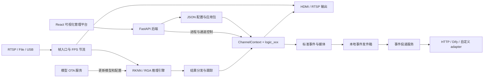

# RK3588 可扩展多路视觉分析引擎与管理平台

> 让 RK3588 多路视觉算法从“每个项目从零重新搭一遍”，变成可复用、可快捷开发、部署、便于维护的工程平台。

本项目是一套面向 RK3588 边缘设备的高性能、多路、可扩展视觉分析引擎，并配备完整的 Web
可视化管理平台。它将视频采集、RKNN 推理、目标跟踪、业务算法、画面显示、RTSP 推流、
事件录像和可靠上报组织成统一运行管线，帮助开发者更快地把一个视觉算法原型转化为能够在
现场长期运行和远程维护的实际应用。

传统视觉项目往往把视频源、模型、业务判断、线程调度和上报代码紧密耦合。需求一变，就需要
复制工程、修改主流程、重新编译并重新调试。本项目通过 `ChannelContext`、自注册 Logic、
声明式配置和 Web 编排，将业务算法与底层运行框架分离：同一个 Logic 可以组合到不同视频源和
不同通道，新业务也可以在不破坏既有模块的情况下持续扩展。

无论是园区安防、工业检测、人员行为分析，还是需要多摄像头、多模型协同的边缘 AI视觉检测
场景，都可以在这套框架上复用已有的采集、推理、显示、录像、上报和运维能力，把开发重点真正
放回业务算法本身。

## 为什么选择本项目

- **面向 RK3588 进行深度优化**：统一使用 RKNN NPU、RGA、MPP 和 GStreamer，兼顾多路并发、
  低延迟预览和边缘设备资源约束；
- **业务逻辑低耦合**：算法开发者围绕 `ChannelContext` 编写独立 Logic，无需重复处理视频解码、
  NPU 调度、线程生命周期等底层工作；
- **任意通道灵活组合**：RTSP、USB 摄像头和视频文件可以按配置绑定不同模型、ROI、Logic 和
  上报策略，同一模块能够跨项目复用；
- **不止是推理 Demo**：项目同时覆盖配置、启动、实时画面、日志、录像、断网重试、OTA、
  网络设置、systemd 服务和离线交付；
- **降低二次开发门槛**：课程 Logic、模块清单、配置 Schema、开发向导和 Web 画布共同约束
  开发方式，让新人能够沿着统一规则逐步参与；
- **适合长期维护**：应用包、运行数据和控制台彼此分离，支持配置热更新、版本化接口契约和
  可重复的部署流程。

仓库提供从基础绘制、推理结果读取、ROI 判断、跨帧状态、按钮动作到事件上报的课程示例，也包含
行车安全、人员警戒、跌倒检测、GPIO/继电器等实际业务模块，可作为教学、科研和工程二次开发的
共同起点。

> 当前主要验证平台是 RK3588/AArch64。内核、设备树和 RKNPU/RGA/MPP 驱动必须来自适配板卡的
> BSP。离线包不能跨发行版使用：Debian 11、Ubuntu 22.04 等系统必须分别在同版本 ARM64
> 制作机上生成 bundle。仓库当前记录的完整硬件基线是 Debian 11；Ubuntu 需要重新制包并完成
> 摄像头、NPU、RGA/MPP、显示和推流冒烟测试后，才能视为已验证平台。

## 从哪里开始

| 目标 | 建议入口 |
|---|---|
| 第一次了解系统 | 先阅读下方“系统架构”和“仓库结构”，再完成“快速开始” |
| 开发一个业务算法 | [通道 Logic 开发指南](docs/skills/rk3588-channel-logic/SKILL.md) |
| 开发跨通道逻辑 | [全局 Logic 开发指南](docs/skills/rk3588-global-logic/SKILL.md) |
| 修改引擎、线程或生命周期 | [源码模块索引](docs/skills/rk3588-src-modules/SKILL.md) |
| 操作 Web、投递、OTA 或排障 | [控制台与运维指南](docs/skills/rk3588-console-ops/SKILL.md) |
| 首次配置设备网络 | [first_net_config 使用说明](first_net_config/README.md) |
| 制作断网安装包 | [离线环境与控制台安装](offline_install_env_debian/README.md) |
| 查阅全部文档 | [文档总入口](docs/README.md) |

仓库中的 `logic_course_01`～`logic_course_10` 是逐步学习 Logic API 的示例。第一次接触项目时，
建议先运行已有配置，再修改一个示例模块，不要直接从采集、推理或多线程核心开始。

## AI 辅助 Logic 开发（实验功能，未开发完成）

安装并登录 Codex CLI 或 Claude Code 后，可在仓库根目录运行：

```bash
./develop_feature
```

Windows 可使用 `develop_feature.cmd`。向导只允许回写通道和全局 Logic 目录；涉及 Web、服务、
配置格式或引擎核心的需求会报告超出边界。常用参数：

```bash
./develop_feature --check
./develop_feature --plan-only
./develop_feature --confirm-before-code
```

详细边界见 [AI 开发向导](docs/skills/rk3588-feature-wizard/SKILL.md)。报警、图片/视频及 HTTP/Dify
上报请先阅读[事件与上报开发](docs/skills/rk3588-console-ops/references/event-reporting.md)。

## 项目组成

- **视觉分析运行引擎（底层设施）**：C++ 实现的多路视频采集、推理、跟踪、业务逻辑和输出管线；
- **程序管理平台（前端）**：React + FastAPI 实现的可视化配置、程序管理、实时画面、日志、记录、终端和服务控制；
- **业务应用（核心）**：通过 `logic_xxx` 模块和 JSON 配置构建的具体分析方案；
- **设备工具与部署**：首次网络配置、依赖安装、离线 bundle、GPIO 和继电器测试工具。

> Web 画布编排的是视频源、模型、ROI、业务逻辑和上报等固定角色，不是任意 DAG 工作流引擎。

## 核心能力

### 视频推理能力

- RTSP、视频文件和 USB 摄像头输入；
- 最多 15 个稳定通道 ID；
- YOLOv5 检测、YOLOv8 检测、YOLOv8-Pose、YOLOv5-Seg；
- 单通道多模型组合推理，结果按同一帧合并；
- RKNN NPU 多核心分配、RGA 图像转换和 DMA-BUF 零拷贝优先路径；
- 支持多路并发推理；在作者验证的多路配置中，3 个 NPU 核心利用率均可达到 95% 以上，
  实际吞吐量取决于模型、分辨率、视频源、驱动和散热条件；
- 每通道独立 FPS、模型阈值、类别过滤和跟踪参数；任务队列深度当前来自全局 `queue_size`；
- SORT风格目标跟踪及稳定 `track_id`；
- 推理通道和无模型传统 CV 通道可同时运行。

### 业务逻辑灵活拓展能力

- 每种业务逻辑位于独立的 `src/logic/modules/logic_xxx/` 目录；
- 通过 `REGISTER_LOGIC(logic_xxx)` 自动注册，无需修改中央分发表；
- `ChannelContext` 提供帧、推理结果、ROI、时间、状态、参数、绘制和跨通道快照；
- `logic.json` 统一声明模块参数、Web 动作、上报字段及热重载策略；
- 每通道拥有独立的 `ctx->state`，同一逻辑可安全复用于多个通道；
- 支持业务按钮动作、系统级动作和跨通道全局逻辑；
- Logic 与视频通道可按配置组合；
- 新增 Logic 无需修改其他业务模块，并与线程调度、视频解码等底层实现解耦。

### 显示、录像与事件投递

- HDMI/GTK 窗格显示；
- 内置 RTSP 服务，可流式输出与本地显示一致的拼接画面；
- ROI、检测框、姿态、分割和自定义绘制统一渲染；
- 带标注图片、原始图片与事件视频（`none` 保持源分辨率，`custom`/`all` 按实时显示窗格渲染）；
- 事件前后视频环形缓冲和异步 MP4 编码；
- 本地持久化事件发件箱，断网时保留并自动重试；
- `http` 与 `dify_workflow` Adapter，支持可复用接口契约、图片、视频和纯数据事件；
- Web 请求预览、本地事件测试发送与可扩展 adapter catalog；
- 每个 delivery 独立维护上传状态，全部成功后自动删除本地事件。

### Web 管理平台

- 可视化编排视频源、模型、ROI、业务逻辑、参数和上报策略；
- 应用包上传、安装、启动、停止和状态查看；
- 支持选择不同配置文件启动；
- 实时画面、运行日志和待上报记录查看；
- 独立视频采集页面：RTSP H.264 原码流直接封装 MP4；H.265/H.265+ 通过 RK3588
  MPP 硬件解码、硬件编码为标准 H.264 MP4，避免不同摄像头的 H.265 封装差异；
  USB MJPEG/NV12/YUYV 统一以受控码率的软件编码生成高质量 H.264，
  避免逐帧 MJPEG 文件过大，并正确处理非 16 对齐分辨率和 MJPEG 色彩范围；
- Web 按钮向指定通道业务逻辑发送动作（动作处理逻辑由业务模块实现）；
- 浏览器终端、板级后台服务管理，以及当前应用独立的投递连接、接口契约和 OTA 配置；
- 配置保存后由 C++ 运行时自动检测并热更新。

## 系统架构



### 单帧运行链路

```text
GStreamer appsink
  → pipeline_submit_frame()
  ├─ 按录像自身 FPS → 事件视频源帧缓存
  └─ 每通道业务 max_fps 节流
       ├─ 无推理通道：按需惰性取帧 → 同步执行传统 CV logic
       ├─ 最新源帧 → HDMI/有客户端的 RTSP 预览队列
       └─ 推理通道：任务队列 → RKNN worker → 同帧结果分发
       → tracker
       → 构造 ChannelContext
       → 执行动作处理器
       → 执行当前 logic_xxx
       → 原子写回 frame / results / state / draw commands
       → 显示叠加、事件图片和跨通道快照
```

业务发布与事件图片通过版本检查保持帧/结果一致；事件视频走独立源帧环形缓冲；实时预览优先显示
最新解码帧，并使用最近结果进行叠加，以降低观看延迟。

## 仓库结构

```text
.
├── vision_analysis/             # C++ 视觉分析引擎、示例业务和应用构建脚本
│   ├── assets/                  # RKNN 模型、标签和示例配置
│   ├── scripts/                 # logic 清单生成与一致性校验
│   ├── src/
│   │   ├── capturer/            # GStreamer RTSP/File/USB 采集与重连
│   │   ├── pipeline/            # 帧入口、结果分发与业务调用
│   │   ├── inference/           # 推理任务、模型实例与热换
│   │   ├── tracking/            # 每通道目标跟踪
│   │   ├── logic/core/          # ChannelContext、注册表、参数和全局逻辑
│   │   ├── logic/modules/       # 可扩展业务逻辑模块
│   │   ├── logic/global_modules/ # 可扩展全局逻辑模块
│   │   ├── display/             # HDMI 显示与统一叠加
│   │   ├── rtsp/                # 拼接画面 RTSP 输出
│   │   ├── event/               # 标准事件与媒体发件箱生产端
│   │   ├── recorder/            # 事件前后视频
│   │   ├── control/             # Web/外部通道动作控制
│   │   ├── config/              # 配置解析、校验和热重载字段
│   │   ├── runtime/             # APP_CTRL、快照与运行状态
│   │   └── yolo/                # RKNN 模型实现与后处理
│   ├── CMakeLists.txt
│   └── build.sh                 # 编译、打包和运行脚本生成
├── web_console/
│   ├── frontend/                # React、TypeScript、XYFlow、Zustand
│   ├── backend/                 # FastAPI 管理 API 与 WebSocket
│   └── install.sh               # Web 控制台安装脚本
├── service/
│   ├── upload/                  # 可靠事件上传服务
│   └── model_update/            # 模型 OTA 服务
├── first_net_config/            # 独立的首次网络配置终端工具（C + ANSI/termios）
├── offline_install_env_debian/  # Debian/Ubuntu 同发行版离线仓库制作与安装
├── gpio_test/                   # GPIO 独立测试工具
├── relay_test/                  # 继电器独立测试工具
├── docs/                        # 开发、运维和模块文档
├── develop_feature              # Codex/Claude 隔离式 Logic 需求澄清与自动开发入口
├── develop_feature.cmd          # 原生 Windows 的同一向导入口
├── install_deps.sh              # 联网安装或只读检查第三方环境
└── LICENSE                      # GPL-3.0
```

## 支持的模型与输入源

| 类别 | 当前支持 |
|---|---|
| 输入源 | `rtsp`、`file`、`usb` |
| 模型类型 | `yolov5`、`yolov8_det`、`yolov8_pose`、`yolo26_pose`、`yolov5_seg` |
| 模型格式 | Rockchip RKNN |
| 图像处理 | OpenCV、RGA |
| 解码与推流 | GStreamer、GStreamer RTSP Server |
| 本地显示 | GTK3 |
| 管理前端 | React、TypeScript、Vite、XYFlow、Zustand |
| 管理后端 | FastAPI、WebSocket |

新增模型类型目前需要实现 `ModelBase` 并在模型工厂中注册，然后重新编译主程序。

YOLO26 人体姿态模型使用独立类型 `yolo26_pose`，适配 Ultralytics 导出的
`[1,56,8400]` FP16 one-to-many 输出。项目已内置模型
`vision_analysis/assets/yolo26n-pose-rk3588.rknn`，该类型不要求标签文件：

```json
{
  "id": "pose26",
  "enable": true,
  "model_type": "yolo26_pose",
  "model_path": "assets/yolo26n-pose-rk3588.rknn",
  "label_path": "",
  "obj_thresh": 0.25,
  "nms_thresh": 0.45,
  "detect_classes": [],
  "npu_core": -1
}
```

完整的单路配置见 `vision_analysis/assets/config_yolo26_pose.json`。`yolo26_pose`
产出的 `AlgoResult` 与 `yolov8_pose` 一致，包含人员框、17 个 COCO 关键点及其置信度，
可以直接进入跟踪、画面骨架渲染和跌倒检测逻辑。

## 快速开始

### 1. 环境要求

项目主要在搭载 RK3588 的 EAI-BOX-3000 边缘计算盒子上开发和验证：

- RK3588 / AArch64 Linux；
- Debian、Ubuntu、Armbian 或兼容发行版；
- 可用的 Rockchip RKNPU 内核驱动和 RGA；RKNN 用户态 Runtime 已由项目固定；
- GStreamer 1.x；
- 带 `freetype` 模块的 OpenCV；
- 构建 Web 前端时需要 Node.js 18+。

“可以运行脚本”不等于“发行版之间二进制兼容”。尤其是离线仓库中的 FFmpeg、OpenCV、Python
和 systemd 软件包具有精确版本关系，必须遵守：

```text
制作机发行版 + 版本 + 架构 = 目标机发行版 + 版本 + 架构
```

例如 Debian 11 bundle 只能用于 Debian 11 ARM64，Ubuntu 22.04 bundle 必须在 Ubuntu 22.04
ARM64 制作。不要把 Debian bundle 强制安装到 Ubuntu，也不要通过降级系统库解决冲突。
硬件验证基线见
[平台兼容矩阵](docs/skills/rk3588-feature-wizard/references/platform-matrix.md)。

### 2. 安装依赖

设备可以联网时，默认安装运行环境、C/C++ 编译环境，并预构建 Web 前端：

```bash
bash install_deps.sh
```

该命令需要在盒子仍能访问 APT、PyPI/npm 镜像时执行，会安装完整第三方运行依赖、
锁定安装前端依赖并预生成 `web_console/frontend/dist`。RKNPU 内核驱动、RGA、MPP 等
Rockchip BSP 组件不由该脚本安装；用户态 `librknnrt.so` 和 `rknn_api.h` 已固定在
`vision_analysis/vendor/rknn/`。APT 阶段只补装缺失包，不升级已经安装或被厂家设为
`hold` 的 BSP 包；单个无关软件源更新失败时，会使用其他成功更新的索引继续安装。
Python requirements 直接安装到系统 `/usr/bin/python3`，不会创建项目虚拟环境；已满足
版本约束的模块会由 pip 跳过。这与默认完整离线包采用相同的解释器和依赖规则。

如果目标设备明确只运行预编译应用，可以选择精简环境：

```bash
bash install_deps.sh --runtime-only
```

现场设备不能访问 APT、PyPI 或 npm 时，在系统版本完全相同且可以联网的 ARM64 制作机上
生成环境与 Web 控制台安装包：

```bash
# 制作机必须和目标机使用相同发行版及版本
bash offline_install_env_debian/create_bundle.sh

# 把 output/full-bundle 复制到断网 RK3588，然后在包目录内一键安装
cd /userdata/full-bundle
sudo bash install_offline.sh
```

制包脚本会在制作机临时编译当前 C++ 程序以检测运行依赖，并构建前端，然后把系统依赖、
系统 Python requirements、Web 控制台和 Rockchip 用户态组件组成一个本地 APT 仓库。临时编译的
C++ 程序不会装入目标机的程序列表。目标机只需在所选 bundle 目录内运行
`install_offline.sh`，安装完成后可直接访问 `http://<RK3588-IP>:8080`，无需再执行
`web_console/install.sh` 或手工安装依赖。默认完整包也包含源码、板端 C/C++ 编译环境、
ARM64 Node.js/npm 和前端 `node_modules`，源码入口为
`/userdata/rk3588_visual_analysis_framework`；目标机可以直接编译主程序和重新构建前端。
程序仍需由用户之后明确安装，或通过 Web 上传。

联网 `install_deps.sh` 和离线安装现在使用同一套系统 `/usr/bin/python3`；pip 对已经满足
requirements 约束的包会跳过，只补装缺失项或调整不兼容版本。两条路径都会核验模块导入和
依赖关系。仓库不会绑定项目源码哈希；发行版
软件包按制作机对应的软件源解析，开发机上由 dpkg 管理、但软件源没有的厂家用户态包才会重新
封装，项目固定的 RKNN Runtime 也会单独封装。完整包生成到
`offline_install_env_debian/output/full-bundle`，精简包生成到
`offline_install_env_debian/output/runtime-only-bundle`。升级时重新制包并再次运行安装脚本即可；新增依赖和
手工补包方法见
[offline_install_env_debian/README.md](offline_install_env_debian/README.md)。

如需单独排查厂家 BSP、硬件驱动或应用动态库，可运行只读诊断（它不是离线安装步骤，
诊断失败也不代表 deb 安装失败）：

```bash
bash install_deps.sh --check
# 只验收运行环境时：bash install_deps.sh --check --runtime-only
```

`--check` 会进行五层只读检测：系统/架构与已验证基线、RKNPU/RGA/MPP/DMA 设备、
Python/通用动态库、Rockchip GStreamer 硬件插件，以及项目和 `/opt/ai_apps` 中
实际可执行文件的 ELF 架构、`ldd` 和包内 RKNN Runtime 哈希。检测结果分为：

- `[通过]`：当前检查项符合要求；
- `[警告]`：可能可以运行，但驱动版本、可选硬件能力或应用包可追溯性尚未完全验证，
  命令返回值仍为 0；
- `[失败]`：存在会阻止核心功能运行的问题，命令返回非 0。

检查不会启动摄像头、模型或推理进程，因此静态检查通过后仍应使用现场摄像头、实际
`.rknn` 模型和 RTSP/录像输出做一次冒烟测试。项目已经验证的平台组合记录在
`vision_analysis/vendor/rockchip/PLATFORM_COMPATIBILITY.env`；只有完成硬件冒烟测试后
才应更新该基线。

联网设备默认从 pip/npm 软件源安装并重新构建 Web 控制台，无需设置环境变量：

```bash
sudo bash web_console/install.sh online
```

如果只想从源码单独部署 Web 控制台，断网设备才使用 `offline` 模式：

```bash
sudo bash web_console/install.sh offline
```

`web_console/install.sh` 强制要求一个安装模式参数，只接受 `online` 或 `offline`，不会根据
`frontend/dist` 是否存在猜测网络状态。`offline` 模式会完全禁止 pip/npm 联网。使用上面的
离线环境与控制台安装包时，这一步已经由 `vision-analysis` deb 完成，不要重复执行。

`install_deps.sh` 是“联网预配置 + 断网验收”脚本，不包含 deb/wheel/npm 离线安装包；
因此不能把一台从未准备过的裸机带到无公网现场后再首次执行普通安装模式。

目标机仍需使用能正确启动 RK3588 的厂家内核、设备树和固件。离线仓库负责 RGA/MPP、
Rockchip GStreamer 和 RKNN 等用户态组件，但不会尝试用用户态 `.so` 替代内核驱动。

### 2.1 固定的 RKNN Runtime

编译和发布统一使用 `vision_analysis/vendor/rknn/2.4.2a2/` 中的 AArch64 Runtime，
不再根据构建设备的 `ldconfig` 顺序选择 `librknnrt.so`。CMake 和 `build.sh` 都会校验
头文件及 Runtime 的 SHA-256；文件缺失、被替换、架构或版本不符时构建会直接失败。

当前锁定并在 RK3588 / RKNPU driver v0.9.0 上验证的 Runtime 为：

```text
librknnrt version: 2.4.2a2 (5fd9678a8f@2026-04-27T15:52:16)
SHA-256: bf50d51705ae433013927a13520ae781b534fdb1481c47bdddbc726f63ed4970
```

### 3. 板端调试构建

```bash
cd vision_analysis
./build.sh --debug
./vision_analysis ./assets/config_6.json
```

`--debug` 只生成可执行文件，不创建完整应用包。请根据设备修改视频源、模型和标签路径。
调试构建会使用项目锁定的 RKNN 头文件和 Runtime 进行链接；正式运行及跨设备验证请使用
完整发布包，以便由包内 `libs/librknnrt.so` 和 `$ORIGIN/libs` 保证运行时版本一致。

### 4. 构建发布包

```bash
cd vision_analysis
./build.sh dist
```

脚本会自动判断构建方式：

- AArch64/ARM：在板端原生编译；
- x86_64：使用配置好的 `rk3588_builder` Docker 交叉编译镜像。

发布目录 `vision_analysis/dist/` 包含：

- `vision_analysis` 可执行程序；
- `libs/` 动态库，其中 `librknnrt.so` 来自项目锁定版本并带版本清单；
- `assets/` 模型、标签和配置；
- `logics.json` Web 能力清单；
- `services/upload` 和 `services/model_update`；
- `report_templates/`、`run.sh` 和 `setup_python.sh`。

前台运行发布包：

```bash
cd vision_analysis/dist
OFFLINE=1 bash setup_python.sh  # 已执行根目录 install_deps.sh 的现场盒子
bash run.sh ./assets/config_6.json
```

`run.sh` 会把所选配置的 `global.enable_display` 改为 1。生产托管请把完整包安装到 Web 控制台；
当前 `build.sh` 不生成历史文档中的 `deploy.sh`/`stop.sh`。

### 5. 安装 Web 管理平台

```bash
cd web_console
sudo bash install.sh online
```

安装完成后访问：

```text
http://<RK3588-IP>:8080
```

控制台默认从 `/opt/ai_apps/` 扫描应用包。将刚构建的应用包安装到控制台：

```bash
cd vision_analysis
sudo ./install_app.sh dist
```

离线环境包不会自动执行这一步，也不会预装名为 `vision_analysis` 的程序。Web 程序列表只显示
用户明确上传或安装到 `/opt/ai_apps` 的应用。

### 6. 首次网络配置工具

`first_net_config` 是独立的 C/ANSI 终端工具，用于首次设置有线、Wi-Fi、设备名称、路由优先级，
以及检查网络冲突。它直接管理 NetworkManager，不依赖 Web 控制台：

```bash
cd first_net_config
sudo ./first_net_config
```

全屏界面使用 ANSI 转义序列和 Linux/POSIX 自带的 termios，不依赖 ncurses；源码构建只需要
CMake 和 C 编译器。仓库随附 ARM64 成品（要求 glibc 2.29 或更高），可以在 RK3588 离线状态
先完成网络配置，再运行联网依赖安装；修改源码后才需要执行 `./build.sh`。完整功能、SSH
切换网络的回滚方式及高风险操作边界见
[first_net_config/README.md](first_net_config/README.md)。

## 新成员开发路径

建议按下面顺序熟悉项目，不要一开始就修改采集、推理和多线程核心：

1. 在独立测试设备上完成依赖安装、编译、发布包安装、启动、日志查看和删除。
2. 修改一个 `logic_course_xx` 示例，理解 `ChannelContext`、配置参数和绘制接口。
3. 独立新增一个小型通道 Logic，并完成配置校验和板端冒烟测试。
4. 根据个人方向进入 Web 前端、FastAPI 后端、设备工具或 C++ 引擎模块。
5. 最后学习离线制包、系统服务、网络修改和发布回滚。

对每次改动至少要求：能够编译、相关检查通过、异常路径验证、测试设备冒烟测试、文档同步更新，
并由另一名开发者完成代码审查。涉及密码、SSH、网络清理、systemd、文件删除和线程生命周期的
改动不得直接在生产设备上练习。

## 配置示例

配置没有根级版本号契约；OTA 模型版本只写在 `channels[].models[].version`。模型只允许写在
`channels[].models[]`，ROI 只允许写在
`channels[].roi_zones[]`，录像设置只保存在 `report_policy`；`stream.src_type` 必须显式指定。
Web 画布中 ROI 节点直接连接视频流节点，表示它归属于该视频通道；ROI 与模型推理和
后处理算法解耦，即使通道没有配置模型，仍可保存、显示并通过 `ChannelContext` 读取。

```json
{
  "global": {
    "enable_display": false,
    "enable_rtsp": true,
    "disp_width": 1280,
    "disp_height": 720,
    "tile_cols": 1,
    "tile_rows": 1,
    "max_fps": 25,
    "queue_size": 1
  },
  "channels": [
    {
      "id": 0,
      "enable": true,
      "infer_enable": true,
      "stream": {
        "src_type": "rtsp",
        "url": "rtsp://192.168.1.10/live",
        "video_enc": "h264"
      },
      "models": [
        {
          "id": "detector",
          "enable": true,
          "model_type": "yolov8_det",
          "model_path": "assets/yolov8n.rknn",
          "label_path": "assets/labels.txt",
          "version": "",
          "obj_thresh": 0.3,
          "nms_thresh": 0.45,
          "detect_classes": [],
          "npu_core": 0
        }
      ],
      "logic": "logic_default",
      "logic_parameters": {},
      "roi_zones": [
        {
          "name": "entrance",
          "polygon": [[0.1, 0.1], [0.9, 0.1], [0.9, 0.9], [0.1, 0.9]]
        }
      ],
      "report_policy": {
        "enabled": false,
        "deliveries": []
      }
    }
  ]
}
```

通道 `id` 是运行时、Web API、告警、录像和控制动作共同使用的唯一身份，必须唯一且位于 `[0, 15)`。

只校验配置而不启动视频、NPU 和后台线程：

```bash
./vision_analysis --validate-config ./assets/config_6.json
```

## 开发新的通道逻辑

每个通道逻辑由一个 C++ 入口和一个模块清单组成：

```text
vision_analysis/src/logic/modules/logic_people_count/
├── logic.cpp
└── logic.json
```

最小 `logic.cpp`：

```cpp
#include "logic/core/logic_common.h"

static void logic_people_count(ChannelContext *ctx)
{
    const int count = ctx->target_count("person");
    draw_text(ctx,
              ("person: " + std::to_string(count)).c_str(),
              cv::Point(20, 40),
              cv::Scalar(0, 255, 0));
}

REGISTER_LOGIC(logic_people_count);
```

最小 `logic.json`：

```json
{
  "label": "人员计数",
  "event_types": [],
  "parameters": {
    "type": "object",
    "additionalProperties": false,
    "properties": {}
  },
  "report_fields": []
}
```

新增模块后重新运行 CMake 或 `build.sh`。构建过程会：

1. 递归收集 `src/logic/modules/` 中的 C++ 源文件；
2. 从 `REGISTER_LOGIC()` 获取唯一 logic ID；
3. 校验 `logic.json`、参数访问器和热重载策略；
4. 将 Schema 嵌入二进制；
5. 在发布包中生成供 Web 使用的 `logics.json`。

普通模块参数应声明在 `logic.json.parameters.properties`，运行时通过以下接口读取：

- `ctx->param_float()`；
- `ctx->param_int()`；
- `ctx->param_bool()`；
- `ctx->param_string()`；
- `ctx->param_json()`。

不要使用函数内 `static` 保存每通道状态；跨帧状态应保存在 `ctx->state`，以避免不同的通道逻辑混用变量。

## 内置通道逻辑

| Logic ID/分组 | 作用 |
|---|---|
| `logic_course_01` … `logic_course_10` | 从绘制、上下文、推理结果、ROI、状态、按钮到事件上报的课程示例 |
| `logic_course_gpio` | 检测结果驱动 GPIO |
| `logic_default` | 可删除的空白逻辑示例 |
| `logic_dify` | Dify 周期截图与自定义变量 |
| `logic_global_input_demo` | 向全局 logic 发布类型化变量 |
| `logic_person_roi_alarm` | 人员警戒区持续停留报警 |
| `logic_fall_detection` | 单路落水与走廊跌倒检测 |
| `logic_crane_motion`、`logic_crane_hook` | 行车运动和吊钩状态检测 |
| `logic_crane_intrusion`、`logic_crane_helmet` | 行车投影区域入侵和静止安全帽检测 |
| `logic_relay` | Action 控制继电器 |

当前全局 Logic 包括 `global_default`、`global_channel_aggregate_demo`、
`global_crane_safety_controller` 和 `global_mongolian_yurt_event`。

当前未注册 `logic_path_sop`。Web 仍有 SOP 节点并会生成这个缺失的 Logic ID，不能作为可运行配置。

通道可以不配置 `logic`。此时仍会执行视频、模型、跟踪和通用绘制管线，但不会调用业务后处理模块。

## 配置热重载

运行时监控当前配置文件，等待文件写入稳定后重新解析。当前支持：

- 阈值、检测类别、队列深度和跟踪参数更新；
- ROI 和 logic 参数更新；
- logic 切换及状态安全清理；
- 模型热替换；
- 视频源地址和 USB 参数切换；
- 全局逻辑实例重启；
- 模块参数的 `preserve_state`、`reset_state`、`restart_required` 策略。

以下变化涉及固定运行拓扑，热重载会拒绝并要求重启：

- 通道数量、ID 或启用状态变化；
- HDMI/RTSP 输出开关、布局、端口、编码等输出拓扑变化。

配置采用不可变运行快照发布。业务帧持有快照后，本帧所见的通道配置、ROI 和模块参数保持一致。

## 告警事件与可靠上传

业务逻辑只调用统一入口：

```cpp
EventRequest request;
request.event_type = "person_enter";
request.message = "检测到人员进入";
request.fields = {
    event_field("label", "person"),
    event_field("count", 1),
};
EventReportResult report = report_event(ctx, request);
if (!report.accepted())
    fprintf(stderr, "report rejected: %s (%s)\n",
            event_report_status_name(report.status), report.detail.c_str());
```

媒体类型、叠加方式、视频前后时间窗、接收端和字段映射由 Web 保存的 `report_policy` 决定。
`report.accepted()` 只表示创建/合并请求已进入本地持久化队列，不表示已经落盘或远端成功；失败时
通过 `status/detail` 精确定位。

事件链路：

```text
channel logic / global logic
  → event_store/<event_id>/event.json
  → media_state.json / delivery_state.json
  → annotated.jpg / raw.jpg / clip.mp4
  → unified_upload 扫描
  → delivery 独立上传和重试
  → 全部成功后删除事件目录
```

全局逻辑使用同一个 `EventRequest` 与 `report_event(gctx, request)`。全局事件图片会把连入该全局
逻辑的全部连入通道按全局显示尺寸和网格规则拼接；图片叠加仍由 `image_overlay` 决定。
`request.source_channel_id` 动态选择事件身份和图片回退来源；事件视频固定使用全局节点的
`media_source_channel_id`。Web 画布以“通道逻辑 → 全局逻辑 → 上报配置”连线生成输入通道和统一
上报策略。

事件目录按写入者拆分：C++ 维护 `event.json` 和 `media_state.json`，并初始化
`delivery_state.json`；此后上传服务独占 delivery 状态，避免两个进程并发覆盖同一份状态。

默认发件箱上限为 1 GiB，并保留至少 512 MiB 可用磁盘空间。可以通过以下环境变量覆盖：

- `EVENT_STORE_DIR`；
- `EVENT_STORE_MAX_BYTES`；
- `EVENT_STORE_MIN_FREE_BYTES`。

## 一致性检查

校验所有 logic 注册、模块清单、参数 Schema 和 C++ 参数访问器：

```bash
cd vision_analysis
python3 scripts/generate_logics_catalog.py --check
```

编译后查看二进制实际注册的通道逻辑：

```bash
./vision_analysis --list-logics
```

构建 Web 前端：

```bash
cd web_console/frontend
npm ci
npm run build
```

运行 Web 后端测试：

```bash
cd web_console/backend
python3 -m pytest -q tests
```

修改安装脚本后检查 Shell 语法：

```bash
bash -n install_deps.sh \
  offline_install_env_debian/create_bundle.sh \
  offline_install_env_debian/templates/install_offline.sh \
  vision_analysis/build.sh
```

测试通过只说明软件层面的静态行为符合预期。涉及摄像头、NPU、RGA/MPP、GPIO、显示、RTSP 或
系统网络的修改，仍须在独立 RK3588 测试设备上进行硬件冒烟测试。

## 项目边界

- 通道 logic 是编译期模块，不是运行时动态加载的 `.so` 插件；
- Web 图编辑器编排固定的视觉分析角色，暂不支持用户自定义 DAG；
- 模型类型由 C++ 模型工厂注册，新增类型需要重新编译；
- 全局 logic 与通道 logic 一样是编译期自注册模块；
- Web 的 SOP 节点与当前缺失的 `logic_path_sop` 是已知实现缺口。

## 文档

- [文档总入口](docs/README.md)
- [首次网络配置工具](first_net_config/README.md)
- [离线环境与 Web 控制台安装](offline_install_env_debian/README.md)
- [Skill 与二次开发索引](docs/skills/README.md)
- [交互式功能开发总入口](docs/skills/rk3588-feature-wizard/SKILL.md)
- [通道逻辑开发指南](docs/skills/rk3588-channel-logic/SKILL.md)
- [全局逻辑开发指南](docs/skills/rk3588-global-logic/SKILL.md)
- [控制台、部署与运维指南](docs/skills/rk3588-console-ops/SKILL.md)
- [源码模块索引](docs/skills/rk3588-src-modules/SKILL.md)

如文档与当前实现存在差异，以源码、头文件、模块 `logic.json`、前端序列化和后端路由为准。

维护 README 时避免记录未经复测的性能结论；发行版、驱动、RKNN Runtime、模型或配置契约变化后，
必须同步更新兼容性说明和对应模块文档。

## 项目愿景

本项目受到 GNU 计划与自由软件运动的启发。我们相信，软件不应只是一个无法理解和修改的封闭工具，
也应当成为可以学习、验证、改进和继续传播的公共知识。开源的价值不仅是公开代码，更是让工程经验
能够被后来者继承，让不同开发者在清晰的规则和可复现的实现上继续创造。

我们希望这套框架能够为 RK3588 及其他边缘计算平台上的多路视觉应用提供一种可靠的工程思路：
底层能力集中建设，业务模块独立演进，配置和运行状态可视化，部署过程可以复现，现场问题能够定位。
如果它能让一个算法更快落地、让一位新人更容易理解系统，或者让一个团队少重复搭建一次基础设施，
这个项目就实现了它的意义。

如果本项目对你的学习、研究或工程实践有所帮助，欢迎 Star、Fork、提交 Issue 或参与改进，让更多
开发者能够发现、使用并共同完善它。

## License

本项目受到 GNU 计划与自由软件运动的启发，基于
[GNU General Public License v3.0](LICENSE) 开源。问题与建议可联系 Sunny_Wei：
1927096839@qq.com。
