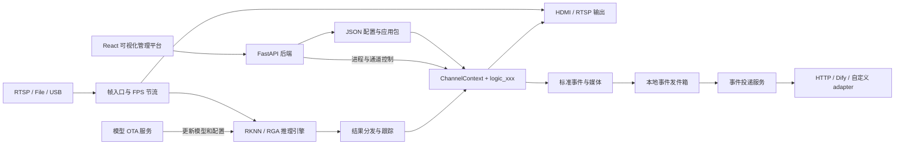

# RK3588 可扩展多路视觉分析引擎与管理平台

本项目是一个运行于 RK3588 边缘设备的可扩展多路视觉分析引擎并配备可视化的web程序管理界面，具有多路视频采集、RKNN 推理、目标跟踪、利用推理结果进行自定义的算法编排等功能。主要解决了过去视觉算法开发中遇到的如下问题：
- 多路视频流在性能受限的边缘端难以同时进行高性能的采集和分析。
- 算法复用性和可拓展性差，过去的算法中视频流和逻辑是绑定的，若要改变某个视频通道的逻辑需要将前一个逻辑删除，若算法耦合性高，则改动较大。但利用本项目的低耦合设计可将任意算法逻辑绑定至任意视频源类型（RTSP，USB，视频文件）的任意视频通道。
- 视觉算法逻辑的编写没有一个统一的规则来约束开发者，进而导致代码可读性差，维护难度高。本项目将编写视觉算法常用的变量，如模型推理结果，视频帧，时间戳等变量都封装至一个上下文结构体ChannelContext中供开发者调用。
- 视觉算法逻辑编写的时候常与底层逻辑（如视频解码，线程调度等）进行交互，导致开发难度高。开发者利用本项目中引擎的低耦合设计来实现视频流分析的时候则只需关注算法逻辑的实现，无需关注底层的设计。
- 项目维护难，以前修改某个算法参数需要改配置文件的内容，然后重新编译程序。流程繁琐，本项目配有web管理界面，程序的参数可在界面上直接修改。
- 算法启动流程复杂，本项目配备的可视化界面便于开发者或运维人员将算法应用至选定的视频流，并且能够设定服务器上报之类的与后端通信的相关配置。
- 调试困难，以前调试视觉算法的时候只能板端接显示屏，远程调试的时候则无法看见画面。本项目配备的web管理界面可观看程序的实时画面输出，并在界面侧边栏显示程序的终端输出。  

项目仓库配有演示基本功能的demo便于二次开发者了解利用引擎基本功能构建自己视觉分析应用的过程。    
> 若第一次接触本项目, 强烈建议通过教程的程序实例来初步理解视觉程序的构建方式。   

第一次开发报警、图片/视频或 HTTP/Dify 上报功能，请从
[报警事件与上报开发指南](docs/报警事件与上报开发指南.md) 开始；该文档同时提供快速上手流程
和可直接交给大模型的开发提示词。

事件投递采用“连接 Profile + 接口契约 + adapter”三层配置。算法 logic 只填写标准事件和动态
`fields`；服务器要求的固定值、远端字段名、媒体和成功条件集中写在
`service/upload/contracts/*.json`；Profile 只保存地址、密钥和 Header。只有接入全新交互协议
或签名算法时才需要新增 adapter，不应修改算法 logic 或 C++ 事件核心。

项目由三层组成：

- **视觉分析运行引擎**：C++ 实现的多路视频采集、推理、跟踪、业务逻辑和输出管线；
- **程序管理平台**：React + FastAPI 实现的可视化配置、程序管理、实时画面、日志、记录、终端和服务控制；
- **业务应用**：通过 `logic_xxx` 模块和 JSON 配置构建的具体分析方案。

> 本项目不是通用的任意DAG（有向无环图）工作流引擎。Web 画布用于编排视频源、模型、ROI、业务逻辑和上报等固定角色，运行时将其转换为稳定的多通道分析管线。
  
本项目受到 GNU 计划与自由软件运动的启发，并向所有长期致力于软件自由、知识共享与技术公共化的开发者致敬。如果本项目对你有所帮助，欢迎为仓库点亮一颗⭐。这不仅是对项目的认可，也能帮助更多开发者发现、使用和推广这个项目。我们相信，软件不应只是封闭的工具，也应当成为可以被学习、理解、改进和传播的公共知识。开放源代码的意义，不仅在于可以让任何人出于任何目的使用，修改，发布软件，更在于让技术成果能够接受时间检验、持续演进，并服务更多的人。本项目希望在嵌入式视觉、边缘计算与人工智能应用领域，尽可能提供清晰、透明且可复现的实现，使开发者能够自由地研究代码、改进功能，并将有价值的成果继续传递下去。  

对于本项目中的多路视觉推理引擎的设计，作者认为是目前RK3588上设计多路视觉算法的最优解，相关的设计理念也可以推广到其他载板的需要执行多路视频流，多种视觉算法逻辑的边缘设备上。 

如有任何疑问或建议，欢迎随时联系作者Sunny_Wei。Email：1927096839@qq.com。  
祝朋友们编程愉快！ Happy coding :-)

## 核心能力

### 视频推理能力

- RTSP、视频文件和 USB 摄像头输入；
- 最多 15 个稳定通道 ID；
- YOLOv5 检测、YOLOv8 检测、YOLOv8-Pose、YOLOv5-Seg；
- 单通道多模型组合推理，结果按同一帧合并；
- RKNN NPU 多核心分配、RGA 图像转换和 DMA-BUF 零拷贝优先路径
- 充分压榨npu算力，可以实现多路推理时npu的3个核心占用率均在95%以上
- 每通道独立 FPS、队列深度、阈值、类别过滤和跟踪参数；
- SORT风格目标跟踪及稳定 `track_id`；
- 推理通道和无模型传统 CV 通道可同时运行。

### 业务逻辑灵活拓展能力

- 每种业务逻辑位于独立的 `src/logic/modules/logic_xxx/` 目录；
- 通过 `REGISTER_LOGIC(logic_xxx)` 自动注册，无需修改中央分发表；
- `ChannelContext` 提供帧、推理结果、ROI、时间、状态、参数、绘制和跨通道快照；
- `logic.json` 统一声明模块参数、Web 动作、上报字段及热重载策略；
- 每通道拥有独立的 `ctx->state`，同一逻辑可安全复用于多个通道；
- 支持业务按钮动作、系统级动作和跨通道全局逻辑。
- 任意逻辑与任意视频通道可自由组合。
- 新增逻辑时无需变动旧的逻辑的相关代码，且上层通道逻辑与底层（线程调度，视频解码等模块）解耦。

### 显示、录像与事件投递

- HDMI/GTK 窗格显示；
- 内置 RTSP 服务，可流式输出与本地显示一致的拼接画面；
- ROI、检测框、姿态、分割和自定义绘制统一渲染；
- 带标注图片、原始图片与原始分辨率事件视频；
- 事件前后视频环形缓冲和异步 MP4 编码；
- 本地持久化事件发件箱，断网时保留并自动重试；
- `http_json` 与 `dify_workflow` adapter，支持可复用接口契约、图片、视频和纯数据事件；
- Web 请求预览、本地事件测试发送与可扩展 adapter catalog；
- 每个 delivery 独立维护上传状态，全部成功后自动删除本地事件。

### Web 管理平台

- 可视化编排视频源、模型、ROI、业务逻辑、参数和上报策略；
- 应用包上传、安装、启动、停止和状态查看；
- 支持选择不同配置文件启动；
- 实时画面、运行日志和待上报记录查看；
- Web 按钮向指定通道业务逻辑发送动作（需自行编写按钮的功能）
- 浏览器终端、后台服务管理、上传连接和 OTA 配置；
- 配置保存后由 C++ 运行时自动检测并热更新。

## 系统架构



### 单帧运行链路

```text
GStreamer appsink
  → videoOutHandle
  → 事件视频源帧缓存
  → 每通道 FPS 节流
  → RGA 将视频帧转换为模型输入尺寸
  ├─ 无模型通道：同步执行传统 CV logic
  └─ 推理通道：任务队列 → RKNN worker → 同帧结果分发
       → tracker
       → 构造 ChannelContext
       → 执行动作处理器
       → 执行当前 logic_xxx
       → 原子写回 frame / results / state / draw commands
       → 显示、事件媒体、录像和跨通道快照
```

业务 logic 和事件媒体路径使用严格匹配的同帧图像与结果；实时预览优先显示最新解码帧，并使用最近结果进行叠加，以降低观看延迟。

## 仓库结构

```text
.
├── vision_analysis/             # C++ 视觉分析运行引擎与默认应用
│   ├── assets/                  # RKNN 模型、标签和示例配置
│   ├── scripts/                 # logic 清单生成与一致性校验
│   ├── src/
│   │   ├── capturer/            # GStreamer RTSP/File/USB 采集与重连
│   │   ├── analyzer/            # 帧入口、推理调度、跟踪和结果分发
│   │   ├── yolo/                # RKNN 模型实现与多模型组合
│   │   ├── logic/core/          # ChannelContext、注册表、参数和全局逻辑
│   │   ├── logic/modules/       # 可扩展业务逻辑模块
│   │   ├── player/              # HDMI 显示、叠加和 RTSP 输出
│   │   ├── event/               # 标准事件与媒体发件箱生产端
│   │   ├── recorder/            # 事件前后视频
│   │   ├── control/             # Web/外部通道动作控制
│   │   ├── config/              # 配置解析、校验和热重载字段
│   │   └── core/                # 全局控制块与运行时基础能力
│   ├── tests/                   # C++ 单元测试
│   ├── CMakeLists.txt
│   └── build.sh                 # 编译、打包和部署脚本生成
├── web_console/
│   ├── frontend/                # React、TypeScript、XYFlow、Zustand
│   ├── backend/                 # FastAPI 管理 API 与 WebSocket
│   └── install.sh               # Web 控制台安装脚本
├── service/
│   ├── upload/                  # 可靠事件上传服务
│   └── model_update/            # 模型 OTA 服务
├── docs/                        # 开发、运维和模块文档
├── install_deps.sh              # RK3588 依赖安装
└── LICENSE                      # GPL-3.0
```

## 支持的模型与输入源

| 类别 | 当前支持 |
|---|---|
| 输入源 | `rtsp`、`file`、`usb` |
| 模型类型 | `yolov5`、`yolov8_det`、`yolov8_pose`、`yolov5_seg` |
| 模型格式 | Rockchip RKNN |
| 图像处理 | OpenCV、RGA |
| 解码与推流 | GStreamer、GStreamer RTSP Server |
| 本地显示 | GTK3 |
| 管理前端 | React、TypeScript、Vite、XYFlow、Zustand |
| 管理后端 | FastAPI、WebSocket |

新增模型类型目前需要实现 `ModelBase` 并在模型工厂中注册，然后重新编译主程序。

## 快速开始

### 1. 环境要求
  开发者在载板为RK3588的 EAI-BOX-3000 边缘计算盒子上进行项目的开发与验证。
- RK3588 / AArch64 Linux；
- Debian、Ubuntu、Armbian 或兼容发行版；
- 可用的 Rockchip RKNN Runtime 和 RGA；
- GStreamer 1.x；
- 带 `freetype` 模块的 OpenCV；
- 构建 Web 前端时需要 Node.js 18+。

### 2. 安装依赖

只运行预编译应用包：

```bash
bash install_deps.sh
```

若需要在 RK3588 板端从源码编译（通常不需要）：

```bash
bash install_deps.sh --build
```

Rockchip RKNN/RGA 的头文件和运行库通常由板卡 BSP、系统镜像或交叉编译环境提供，若没有安装相关的文件，需要参考瑞芯微官方的相关文档进行安装。

### 3. 板端调试构建

```bash
cd vision_analysis
./build.sh --debug
./vision_analysis ./assets/config_xx.json
```

`--debug` 只生成可执行文件，不创建完整应用包。请根据设备修改视频源、模型和标签路径。

### 4. 构建发布包

```bash
cd vision_analysis
./build.sh dist
```

脚本会自动判断构建方式：

- AArch64/ARM：在板端原生编译；
- x86_64：使用配置好的 `rk3588_builder` Docker 交叉编译镜像。

发布目录 `vision_analysis/dist/` 包含：

- `vision_analysis` 可执行程序；
- `assets/` 模型、标签和配置；
- `logics.json` Web 能力清单；
- `services/upload` 和 `services/model_update`；
- `run.sh`、`deploy.sh`、`stop.sh`、`setup_python.sh`。

前台运行发布包：

```bash
cd vision_analysis/dist
bash setup_python.sh
bash run.sh ./assets/config_sop.json
```

注册为 systemd 服务：

```bash
cd vision_analysis/dist
bash deploy.sh ./assets/config_sop.json
```

`deploy.sh` 会交互式选择是否启动视觉主程序、模型 OTA 和统一上传服务。

### 5. 安装 Web 管理平台

```bash
cd web_console
sudo bash install.sh
```

安装完成后访问：

```text
http://<RK3588-IP>:8080
```

控制台默认从 `/opt/ai_apps/` 扫描应用包。将刚构建的应用包安装到控制台：

```bash
cd vision_analysis
sudo ./install_app.sh dist
```

## 配置示例

配置不使用版本号字段。模型只允许写在 `channels[].models[]`，ROI 只允许写在
`channels[].roi_zones[]`，录像设置只保存在 `report_policy`；`stream.src_type` 必须显式指定。
Web 画布中 ROI 节点直接连接视频流节点，表示它归属于该视频通道；ROI 与模型推理和
后处理算法解耦，即使通道没有配置模型，仍可保存、显示并通过 `ChannelContext` 读取。

```json
{
  "global": {
    "enable_display": false,
    "enable_rtsp": true,
    "disp_width": 1280,
    "disp_height": 720,
    "tile_cols": 1,
    "tile_rows": 1,
    "max_fps": 25,
    "queue_size": 1,
    "obj_thresh": 0.3,
    "nms_thresh": 0.45
  },
  "channels": [
    {
      "id": 0,
      "enable": true,
      "infer_enable": true,
      "stream": {
        "src_type": "rtsp",
        "url": "rtsp://192.168.1.10/live",
        "video_enc": "h264"
      },
      "models": [
        {
          "id": "detector",
          "enable": true,
          "model_type": "yolov8_det",
          "model_path": "assets/yolov8n.rknn",
          "label_path": "assets/labels.txt",
          "version": "",
          "obj_thresh": 0.3,
          "nms_thresh": 0.45,
          "detect_classes": [],
          "npu_core": 0
        }
      ],
      "logic": "logic_default",
      "logic_parameters": {},
      "roi_zones": [
        {
          "name": "entrance",
          "polygon": [[0.1, 0.1], [0.9, 0.1], [0.9, 0.9], [0.1, 0.9]]
        }
      ],
      "report_policy": {
        "enabled": false,
        "deliveries": []
      }
    }
  ]
}
```

通道 `id` 是运行时、Web API、告警、录像和控制动作共同使用的唯一身份，必须唯一且位于 `[0, 15)`。

只校验配置而不启动视频、NPU 和后台线程：

```bash
./vision_analysis --validate-config assets/config_sop.json
```

## 开发新的通道逻辑

每个通道逻辑由一个 C++ 入口和一个模块清单组成：

```text
vision_analysis/src/logic/modules/logic_people_count/
├── logic.cpp
└── logic.json
```

最小 `logic.cpp`：

```cpp
#include "logic/core/logic_common.h"

static void logic_people_count(ChannelContext *ctx)
{
    const int count = ctx->target_count("person");
    draw_text(ctx,
              ("person: " + std::to_string(count)).c_str(),
              cv::Point(20, 40),
              cv::Scalar(0, 255, 0));
}

REGISTER_LOGIC(logic_people_count);
```

最小 `logic.json`：

```json
{
  "label": "人员计数",
  "parameters": {
    "type": "object",
    "additionalProperties": false,
    "properties": {}
  },
  "report_fields": []
}
```

新增模块后重新运行 CMake 或 `build.sh`。构建过程会：

1. 递归收集 `src/logic/modules/` 中的 C++ 源文件；
2. 从 `REGISTER_LOGIC()` 获取唯一 logic ID；
3. 校验 `logic.json`、参数访问器和热重载策略；
4. 将 Schema 嵌入二进制；
5. 在发布包中生成供 Web 使用的 `logics.json`。

普通模块参数应声明在 `logic.json.parameters.properties`，运行时通过以下接口读取：

- `ctx->param_float()`；
- `ctx->param_int()`；
- `ctx->param_bool()`；
- `ctx->param_string()`；
- `ctx->param_json()`。

不要使用函数内 `static` 保存每通道状态；跨帧状态应保存在 `ctx->state`，以避免不同的通道逻辑混用变量。

## 内置通道逻辑

| Logic ID | 作用 |
|---|---|
| `logic_path_sop` | SOP 路径、顺序、停留、分支、环路和耗时合规检测 |
| `logic_upload_teach` | Web 按钮触发的标准事件示例 |
| `logic_periodic_snapshot_demo` | 周期截图与参数热重载演示 |
| `logic_save_frame_pair` | 保存原始分辨率帧和模型输入帧 |
| `logic_default` | 可删除的空白逻辑示例 |
| `logic_course_01` | 文字叠加课程示例 |
| `logic_course_02` | `ChannelContext` 使用课程示例 |

通道可以不配置 `logic`。此时仍会执行视频、模型、跟踪和通用绘制管线，但不会调用业务后处理模块。

## 配置热重载

运行时监控当前配置文件，等待文件写入稳定后重新解析。当前支持：

- 阈值、检测类别、队列深度和跟踪参数更新；
- ROI 和 logic 参数更新；
- logic 切换及状态安全清理；
- 模型热替换；
- 视频源地址和 USB 参数切换；
- 全局逻辑实例重启；
- 模块参数的 `preserve_state`、`reset_state`、`restart_required` 策略。

以下变化涉及固定运行拓扑，热重载会拒绝并要求重启：

- 通道数量、ID 或启用状态变化；
- HDMI/RTSP 输出开关、布局、端口、编码等输出拓扑变化。

配置采用不可变运行快照发布。业务帧持有快照后，本帧所见的通道配置、ROI 和模块参数保持一致。

## 告警事件与可靠上传

业务逻辑只调用统一入口：

```cpp
EventRequest request;
request.event_type = "person_enter";
request.message = "检测到人员进入";
request.fields = {
    event_field("label", "person"),
    event_field("count", 1),
};
EventReportResult report = report_event(ctx, request);
if (!report.accepted())
    fprintf(stderr, "report rejected: %s (%s)\n",
            event_report_status_name(report.status), report.detail.c_str());
```

媒体类型、叠加方式、视频前后时间窗、接收端和字段映射由 Web 保存的 `report_policy` 决定。
`report.accepted()` 表示本地事件已创建或合并；失败时通过 `status/detail` 精确定位。

事件链路：

```text
channel logic
  → event_store/<event_id>/event.json
  → media_state.json / delivery_state.json
  → annotated.jpg / raw.jpg / clip.mp4
  → unified_upload 扫描
  → delivery 独立上传和重试
  → 全部成功后删除事件目录
```

事件目录按写入者拆分：C++ 维护 `event.json` 和 `media_state.json`，上传服务独占
`delivery_state.json`，避免两个进程并发覆盖同一份状态。

默认发件箱上限为 1 GiB，并保留至少 512 MiB 可用磁盘空间。可以通过以下环境变量覆盖：

- `EVENT_STORE_DIR`；
- `EVENT_STORE_MAX_BYTES`；
- `EVENT_STORE_MIN_FREE_BYTES`。

## 一致性检查

校验所有 logic 注册、模块清单、参数 Schema 和 C++ 参数访问器：

```bash
cd vision_analysis
python3 scripts/generate_logics_catalog.py --check
```

编译后查看二进制实际注册的通道逻辑：

```bash
./vision_analysis --list-logics
```

构建 Web 前端：

```bash
cd web_console/frontend
npm install
npm run build
```

## 项目边界

- 通道 logic 是编译期模块，不是运行时动态加载的 `.so` 插件；
- Web 图编辑器编排固定的视觉分析角色，暂不支持用户自定义 DAG；
- 模型类型由 C++ 模型工厂注册，新增类型需要重新编译；
- 全局 logic 当前仍采用中央注册方式；
- `logic_path_sop` 是默认业务应用，不是引擎运行所必需的兜底逻辑。

## 文档

- [文档总入口](docs/README.md)
- [二次开发课程大纲](docs/二次开发课程大纲.md)
- [通道逻辑开发指南](docs/skills/rk3588-channel-logic/SKILL.md)
- [全局逻辑开发指南](docs/skills/rk3588-global-logic/SKILL.md)
- [控制台、部署与运维指南](docs/skills/rk3588-console-ops/SKILL.md)
- [源码模块索引](docs/skills/rk3588-src-modules/README.md)

如文档与当前实现存在差异，以源码、头文件、模块 `logic.json`、前端序列化和后端路由为准。

## License

本项目致敬GNU计划，基于 [GNU General Public License v3.0](LICENSE) 开源。
