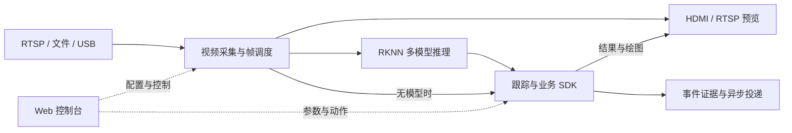

<div align="center">

# RK3588 多路视觉分析框架

**把视频、模型与业务规则，组织成可部署的边缘视觉应用。**

*Build configurable edge vision applications on RK3588.*

[](engine/vendor/rockchip/PLATFORM_COMPATIBILITY.env)
[](engine/vendor/rknn/2.4.2a2/RUNTIME_MANIFEST.txt)
[](LICENSE)
[](https://hits.sh/github.com/LaoWei2001/rk3588_visual_analysis_framework/)

[快速开始](#快速开始) · [模型与业务接入](#模型与业务接入) · [性能实测](#性能与验证) · [文档中心](docs/README.md) · [项目愿景](#项目愿景)

</div>

面向 **Rockchip RK3588** 的 C++ 多路视觉框架，将视频接入、RKNN 推理、目标跟踪、业务规则、事件证据与 Web 运维连接在一起。你通过公开 SDK 编写业务，框架负责共用的视频管线、模型调度、媒体存储与应用管理。

适合需要多摄像头分析、区域告警、工业视觉或现场维护的边缘项目，也适合学习一套视觉应用从算法接入到板端交付的完整实现。

## 核心能力

| 能力 | 你可以做什么 |
| --- | --- |
| **多路视频，一套管线** | 接入 RTSP、文件与 USB 视频，复用相同视频源的解码，输出 HDMI 拼接画面和 RTSP 视频流。 |
| **多模型组合分析** | 组合检测、旋转框、姿态、分割与深度模型；按配置协调 NPU 核心，以有界队列控制积压，分别设置分析、预览与录像节拍。 |
| **用 C++ 表达业务规则** | 通过公开 SDK 查询目标、绘制 ROI、维护跨帧状态、触发事件和控制 GPIO；通道 Logic 与全局 Logic 分别处理单路和跨路业务。 |
| **在浏览器里配置与运维** | 用图形画布连接视频、模型、业务和上报节点，管理应用启停、参数、实时画面、日志、事件与终端。模块参数由 Schema 驱动。 |
| **保留证据，追踪投递** | 为事件保存图片与前后录像，通过本地事件存储和独立上传服务记录发送状态、执行重试；支持按规则采集数据集。 |
| **从开发走向设备交付** | 构建可部署应用包，使用在线安装或离线 bundle；按需配置开机自启、程序恢复、系统看门狗与网络恢复。 |


```mermaid
flowchart LR
    Source["RTSP / 文件 / USB"] --> Capture["视频采集与帧调度"]
    Capture --> Infer["RKNN 多模型推理"]
    Infer --> Logic["跟踪与业务 SDK"]
    Capture -->|无模型时| Logic
    Capture --> Preview["HDMI / RTSP 预览"]
    Logic -->|结果与绘图| Preview
    Logic --> Events["事件证据与异步投递"]
    Web["Web 控制台"] -.->|配置与控制| Capture
    Web -.->|参数与动作| Logic
```

分析、预览和事件录像各有自己的节拍；业务结果与事件图片按同帧处理，实时预览使用最新视频帧叠加最近结果。实现细节见[项目指南](docs/guides/project-guide.md#技术架构)。

## 快速开始

以下操作在 **RK3588 板端**进行。已有验证基线为 **Debian 11 / Linux 5.10.160 / RKNPU 0.9.0**，仓库固定 RKNN Runtime `2.4.2a2`。板卡需提供匹配的 RKNPU、RGA 和 MPP 环境；其他 BSP 或发行版请先核对[平台基线](engine/vendor/rockchip/PLATFORM_COMPATIBILITY.env)。

### 1. 获取源码，安装平台

```bash
git clone https://github.com/LaoWei2001/rk3588_visual_analysis_framework.git
cd rk3588_visual_analysis_framework
sudo ./install.sh online
./install.sh status
```

安装器准备构建依赖并部署 Web、运行管理及 GPIO 等服务。已有环境可先用 `bash install_deps.sh --check` 检查依赖。**首次安装默认将继电器 `GPIO6_A2` 置低并保存状态，执行前请核对接线。**

断网新设备使用完整离线 bundle；`install.sh offline` 适用于依赖已准备好的设备。详见[离线交付](docs/guides/project-guide.md#部署与离线交付)。

### 2. 构建第一个应用

准备一段自己的、MPP 可解码的 H.264 MP4，将下面的 `/path/to/input.mp4` 替换为实际路径。`readme_demo` 请使用一个尚未安装的新应用名。

```bash
./build.sh readme_demo
cp docs/examples/quickstart.json dist/readme_demo/assets/quickstart.json
cp /path/to/input.mp4 dist/readme_demo/assets/input.mp4
sudo ./install_app.sh readme_demo
```

`build.sh` 会把 `projects/assets/` 复制进应用包，交付他人前请筛选现场配置、凭据和媒体。上述示例视频只复制到构建后的包中。

### 3. 在 Web 中启动

打开 **`http://<设备IP>:8080`**，使用板端 Linux 系统账号登录：

1. 在程序管理中选择 `readme_demo` 和 `quickstart.json`，点击“启动”。
2. 打开“实时画面”，查看循环播放的视频；也可用 VLC 打开 `rtsp://<设备IP>:8554/live`。
3. 点击红色“停止”，等待页面确认退出结果。

[最小配置](docs/examples/quickstart.json)只验证视频链路，关闭 HDMI、模型推理与自定义业务。接下来将兼容的 RKNN 权重及所需标签放入已安装应用的 `assets/`，再在配置编辑器中添加模型、开启推理并选择业务模块。具体操作见 [Web 控制台手册](docs/skills/rk3588-console-ops/references/web-console-user-guide.md)。

Web 主动停止会等待引擎清理，并核对退出记录；若提示“未确认完整清理”，请按[停止与退出结果说明](docs/operations/application-recovery.md#用户主动停止与退出结果)检查日志。

<details>
<summary><strong>命令行运行与配置检查</strong></summary>

先停止其他视觉实例，在仓库根目录执行：

```bash
cd dist/readme_demo
export ASSETS_DIR="$PWD/assets"
export LD_LIBRARY_PATH="$PWD/libs:$LD_LIBRARY_PATH"
./vision_analysis --validate-config ./assets/quickstart.json
./vision_analysis ./assets/quickstart.json
```

日志输出到当前终端，按 `Ctrl+C` 停止。`--validate-config` 检查配置结构与资源路径，不连接视频或运行推理。无界面运行使用上述直接启动方式；包内 `run.sh` 会把所选配置的 `enable_display` 改为 `1`。

平台目前托管一个运行中的视觉应用，多路视频配置在该应用内部。

</details>

## 模型与业务接入

### 选择模型，组合任务

| 任务 | `model_type` | 主要结果 |
| --- | --- | --- |
| 目标检测 | `yolov5`、`yolov8_det` | 类别、置信度、目标框 |
| 旋转目标检测 | `yolov8_obb` | 旋转框四角与包围框 |
| 姿态估计 | `yolov8_pose`、`yolo26_pose` | 目标框、关键点与置信度 |
| 分割 | `yolov5_seg` | 检测结果与整帧类别掩码 |
| 米制深度 | `yolo26_depth` | 米制深度图 |
| 相对深度 | `zip_depth` | 相对逆深度图，数值越大越近 |

同一通道可以组合多个模型，**每个模型独立读取输入尺寸，结果统一映射到 `640×640` 业务坐标**。业务通过 `model_id` / `model_type` 选择结果，查询目标、分割或深度数据。详见[模型结果契约](docs/reference/model-result-contract.md)与[坐标约定](docs/reference/business-coordinates.md)。

权重和输入视频需自行准备，RKNN 输出布局须符合对应适配器；`yolov5`、`yolov5_seg`、`yolov8_det` 还需匹配的标签文件。ZipDepth 的相对逆深度不能直接作为米制距离。各类型硬件验证范围见[模型验证记录](docs/reference/model-result-contract.md#验证结果2026-10-29)。

### 用一个模块实现业务

业务放在 `projects/modules/`，通过 `logic.cpp` 编写规则、`logic.json` 声明参数与输出。例如，查询整帧中的人员并发布数量：

```cpp
#include <channel.h>

static void logic_person_count(ChannelContext *ctx)
{
    if (!ctx) return;
    TargetQuery query;
    query.labels = {"person"};
    query.min_score = 0.5f;
    query.roi = ROI_FRAME;
    const auto people = ctx->query_targets(query);
    if (people.valid())
        ctx->publish_int("person_count", people.count);
}

REGISTER_LOGIC(logic_person_count);
```

在同目录的 `logic.json` 中声明 `person_count` 为 `integer` 输出，重新构建后即可在通道中选择 `logic_person_count`。`person` 须与模型标签一致；查询无效时不发布新的计数。模块清单、参数表单和注册流程见[业务工作区](projects/README.md)。

进一步实现“区域中持续有人 → 绘制告警 → 保存证据 → 投递事件”，可以直接阅读[区域持续占用报警示例](projects/modules/logic_roi_dwell_demo/README.md)。跨通道联动放在 `projects/global_modules/`，通过全局 Logic 消费各通道发布的数据。

**[SDK 功能索引](engine/include/README.md) · [目标查询](docs/sdk/target-query.md) · [现有业务示例](docs/skills/rk3588-channel-logic/references/current-examples.md)**

SDK 提供随应用编译的源码接口；业务变更需要重新构建，配置热更新范围见[热重载说明](docs/guides/project-guide.md#配置热重载)。

## 架构与目录

**引擎提供共用能力，业务模块定义场景规则，Web 与后台服务负责管理和交付。**

```text
.
├── engine/              C++ 视觉引擎
│   ├── include/         面向业务的公开 SDK
│   ├── src/             应用、管线、媒体、推理、业务框架与事件实现
│   └── vendor/          第三方依赖与平台版本清单
├── projects/            通道/全局业务模块、模型与运行资产
├── web_console/         React + TypeScript 前端、FastAPI 后端
├── services/framework/  运行管理、事件投递、模型更新与设备恢复
├── tools/               构建辅助、板端诊断与离线制包
└── docs/                使用指南、接口、运维与性能记录
```

三个根目录脚本分别负责：`build.sh` 构建应用包，`install.sh` 安装平台，`install_app.sh` 安装应用。代码职责与依赖边界见[整体架构](docs/architecture/overview.md)，C++ 内部目录见[引擎源码导航](engine/README.md)。

## 性能与验证

以下是 **2026-10-26 的历史实机记录**，用于展示特定配置下的整管线表现。设备为 RK3588 / 8 GB，RKNN `2.4.2a2`；三路全自动分配 NPU 核心，每路 3 worker、`queue_size=1`、`max_fps=25`，同时开启 SORT、1280×720 HDMI 和 H.264 RTSP 输出。预热 15 秒，采集 60 秒：

| 同时运行的任务 | 模型输入 | 成功推理 FPS | 结果发布 FPS |
| --- | --- | ---: | ---: |
| RTSP → ZipDepth FP16 | 768×768 | 4.03 | 4.03 |
| USB → YOLOv5n | 640×640 | 17.21 | 17.21 |
| RTSP → YOLOv8 Pose | 640×640 | 24.99 | 24.99 |

两路 RTSP 共享同一视频源与解码器，USB 实际供帧约 17.2 FPS。这组数据说明当时的调度与发布吞吐；完整报告另有标签不匹配说明，识别效果需使用匹配权重、标签及现场数据验证。独立摄像头容量、端到端延迟和长期稳定性需另行测量。

[实机对照与完整条件](docs/performance/npu-core-placement.md) · [原始测量数据](docs/performance/data/2026-10-26-npu-placement.json) · [更多性能记录](docs/performance/README.md) · [软件验证入口](CONTRIBUTING.md)

## 文档导航

| 我想…… | 从这里开始 |
| --- | --- |
| 编译、部署、离线交付 | [项目指南](docs/guides/project-guide.md) |
| 配置画布、看画面、管理应用 | [Web 控制台手册](docs/skills/rk3588-console-ops/references/web-console-user-guide.md) |
| 编写业务、查询接口 | [公共 SDK](docs/sdk/README.md)、[业务工作区](projects/README.md) |
| 采集训练数据、保存录像到电脑 | [数据集采集](docs/guides/dataset-collection.md)、[媒体保存](docs/guides/local-media-saving.md) |
| 排查停止、恢复、日志与设备问题 | [运行与维护](docs/operations/README.md) |
| 理解代码分工或查找其他主题 | [整体架构](docs/architecture/overview.md)、[全部文档](docs/README.md) |

## 贡献与许可证

欢迎一起完善模型适配、业务示例、板卡兼容性、可复现的性能记录与使用文档。发现问题时，请通过 [Issues](https://github.com/LaoWei2001/rk3588_visual_analysis_framework/issues) 提供板卡环境、脱敏配置、复现步骤和日志；提交代码前请阅读[贡献指南](CONTRIBUTING.md)。

项目基于 **[GNU GPL v3.0](LICENSE)** 发布，第三方库、字体和模型遵循各自授权。

作者：**Sunny_Wei** · [1927096839@qq.com](mailto:1927096839@qq.com)

---

## 项目愿景

本项目受到 GNU 计划与自由软件运动的启发。我们相信，软件不应只是一个无法理解和修改的封闭工具，
也应当成为可以学习、验证、改进和继续传播的公共知识。开源的价值不仅是公开代码，更是让工程经验
能够被后来者继承，让不同开发者在清晰的规则和可复现的实现上继续创造。

我们希望这套框架能够为 RK3588 及其他边缘计算平台上的多路视觉应用提供一种可借鉴的实现思路：
底层能力集中建设，业务模块独立演进，配置和运行状态可视化，现场问题能够定位，
常见故障(网络波动，系统崩溃等)可自动修复，整套系统能长时间稳定运行。
如果它能让一位新人更容易理解系统、让一个算法更快落地、让一个团队少重复搭建一次基础设施或者
部署时让使用者少在命令行输入几行命令，这个项目也就实现了它的意义。

本项目融合了作者对边缘视觉的开发，部署，维护的全部理解。如果本项目对你的学习、研究或工程实践有
所帮助，欢迎 Star，提出建议或参与改进，让更多开发者能够发现、使用并共同完善它。

祝朋友们编程愉快！Happy coding！:)
