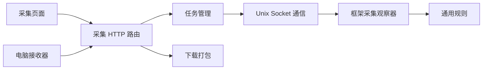

# 电脑采集功能的代码边界

电脑接收器继续使用 Go 启动器和内置 Python。接收器只通过 HTTP 与设备通信，不导入项目后端，也不读取模型、业务模块或引擎配置。

| 层 | 代码位置 | 职责 |
| --- | --- | --- |
| 页面与规则编辑 | `web_console/frontend/src/pages/DatasetPage.tsx`、`components/DatasetTaskEditor.tsx`、`components/DatasetRuleBuilder.tsx` | 页面管理列表与请求状态，任务表单按新建/查看/编辑显示；规则编辑器供任务表单使用 |
| 前端接口 | `web_console/frontend/src/api/dataset.ts` | 采集请求、响应类型与下载；通过 `api/http.ts` 复用登录处理 |
| HTTP 入口 | `web_console/backend/routers/dataset.py` | 请求校验、响应及免登录传输/退出通知接口的边界 |
| 任务管理 | `web_console/backend/services/dataset_manager.py` | SQLite 配置与保存计数、任务同步、接收端在线状态及保存确认 |
| 引擎通信 | `web_console/backend/services/dataset_engine.py` | Unix Socket 的 JSON/JPEG 传输、超时及长度限制；不依赖 FastAPI、数据库或业务模块 |
| 下载打包 | `web_console/backend/services/receiver_package.py` | 通用 EXE 校验与 Python ZIP 构建；不访问任务数据库，不改变接收状态 |
| 框架采集观察器 | `engine/src/control/remote_dataset.{h,cpp}` | 同帧检测结果筛选、后台 JPEG 编码、有界缓存、独立采集 Socket |
| 通用规则 | `engine/src/dataset/rules.{h,cpp}` | 纯规则解析、匹配与触发节流；供框架采集观察器使用，不依赖业务模块 |
| 电脑接收器 | `web_console/backend/resources/dataset_receiver.py` | 标准库 HTTP、电脑目录、原子保存、重试、SQLite 去重及后台存图统计；单一源码同时用于脚本与 EXE |
| Windows 启动器与构建 | `tools/dataset_receiver/` | 配置与目录选择、内置运行时、进程退出监督、交叉构建；不依赖板端后端代码 |

启动配置交互位于独立的 `tools/dataset_receiver/setup.go`。Windows 入口只提供标准输入输出及原生目录选择器；菜单编辑、回车沿用、参数优先级和取消逻辑可独立测试。接收 Python 进程只在完整配置成功保存后启动。

依赖方向如下。采集功能由 Web 配置、框架观察器筛选、电脑接收器保存，不要求配置专用业务模块。

## 与主项目的接入点

- 控制台 `main.py` 注册路由、维护任务生命周期，并调用采集路由提供的免登录策略。只有 `POST /api/dataset-receiver/poll`、`GET /api/dataset-receiver/image`、`POST /api/dataset-receiver/ack`、`POST /api/dataset-receiver/disconnect` 免登录；同前缀的新增接口默认需要控制台登录。
- 引擎 `logic_control.cpp` 管理观察器启动与停止；`channel_pipeline.cpp` 在业务逻辑运行前提供同帧结果和按需取得的原图。观察器不修改业务检测结果，不追加一次推理。
- 框架观察器通过 `dataset/rules.h` 引用通用规则。规则与远程采集测试均在引擎内构建，无需业务模块目录。
- `DatasetManager` 可通过构造参数 `engine` 注入通信客户端。任务管理负责将通信错误转换为 HTTP 错误；Socket 层只处理传输协议。

## 稳定协议与修改位置

电脑只需要设备 URL、保存目录和三个 HTTP 传输接口。轮询取得样本元信息，下载原始 JPEG，成功刷新文件并原子改名后提交确认。`proof` 是程序自动携带的逐图片保存确认信息，用户无需配置凭据。新增任务和修改规则不需要重新下载 EXE。

可选的 `POST /api/dataset-receiver/disconnect` 在退出时携带当前 `client`，立即标记离线并释放占用，保留目录和最后心跳时间。管理层在同一把锁下核对接收编号，重复通知幂等，其他编号不能释放当前接收端。通知在电脑侧使用临时守护线程，整个等待最多 1 秒；兼容没有该接口的旧后端。Windows 启动器只负责等待子进程退出，HTTP 通知仍属于 Python 接收器，不在启动器中引入数据库或后端依赖。进程被强制结束时仍由 15 秒心跳和 30 秒占用超时兜底；页面保持 2 秒轮询。

`InventoryScanner` 是接收脚本内独立的文件统计类，不导入后端或模型模块，也不读取接收数据库。它在电脑侧流式遍历本设备的程序/通道目录，分批让出 CPU，完整统计后发布不可变快照，每轮间隔 5 秒。`poll` 的可选 `inventory` 携带扫描编号、各通道 JPG 数和错误信息；缺少该字段的旧接收器继续正常传图，旧后端忽略新增字段。管理层在接收编号核对通过后保存快照，并返回 `current_files`、`files_updated_at`、`files_error`；不改变引擎协议或累计保存/采集上限。页面显示当前目录中的真实文件数，缺少统计时用未知值，离线时标注上次统计。统计线程与保存线程分离，目录 I/O 阻塞也不会拖住退出。

板端通信继续使用 `run.dataset.sock`，兼容旧路径 `run.control.sock.dataset`；每个请求是一行 JSON，响应为一行 JSON 加指定长度的 JPEG。通信读取保持 4 秒超时、128 KiB 响应头和 12 MiB JPEG 上限。任务、保存计数和确认记录保存在原有 SQLite 文件中，本次整理不迁移数据。

离线删除不依赖引擎确认。管理层在同一个 SQLite 事务中删除任务/确认记录，并将待清理指令写入 `task_removals`。现有后台维护同时检查活跃任务和待清理记录，即使最后一个任务已删除也继续重试。连接恢复后只按已删除任务编号清理：通过现有 `configure` 暂停，再用 `ack` 释放未传 JPEG（保持累计数不变），最后 `remove`；未完成编码或再次断线时保留记录重试。新任务即使使用同一通道也不会被旧记录清除。在线删除仍遵守暂停和待传缓存限制，引擎明确拒绝的错误不会被当成离线成功。整个变更仅在后台管理与页面，不改变帧管线、引擎协议或接收器。

修改页面或后台管理时，不改电脑接收代码。修改规则语义时，调整通用规则、Web 条件编辑器及对应测试。只有改变电脑协议、接收器或启动器时，才需要评估旧 EXE 兼容性和重新构建；不要在业务模块里调用接收器、打包服务或后台数据库。

## 性能边界

未启用采集时保留通道原子标志检查，原图按需取得；不引入额外推理或显示步骤。命中后只有进入有界队列的样本复制原图，JPEG 编码在后台执行。队列满时跳过，避免推理线程等待电脑或磁盘。每路最多 8 张待传图片，全通道共享 64 MiB 队列预算，后台原图队列最多两帧。

代码组织调整没有改变规则算法、帧管线和 JPEG 队列行为，也没有增加运行依赖。回归验证使用真实 C++ Socket、HTTP 和电脑接收器；长期运行和具体现场 FPS 仍需按实际配置测量。
