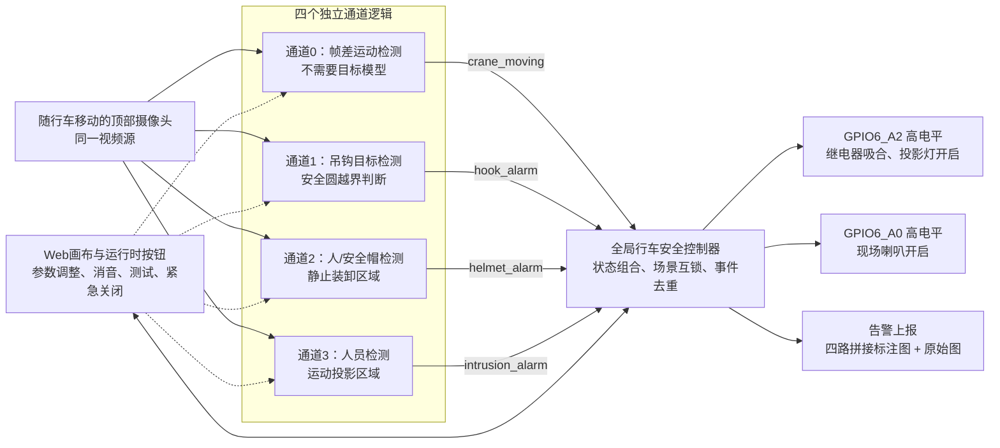
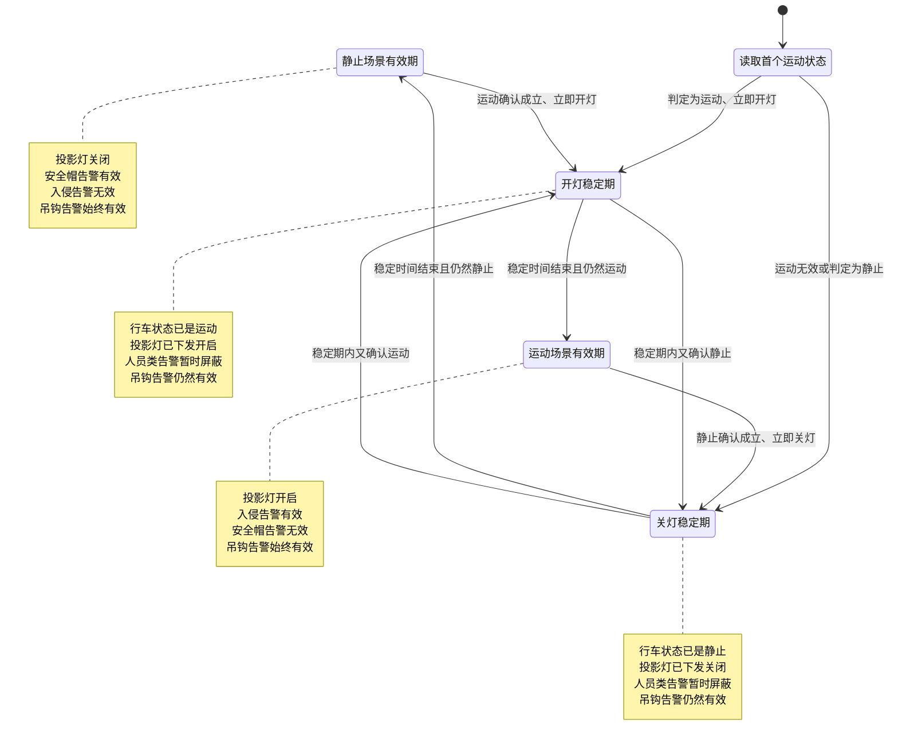
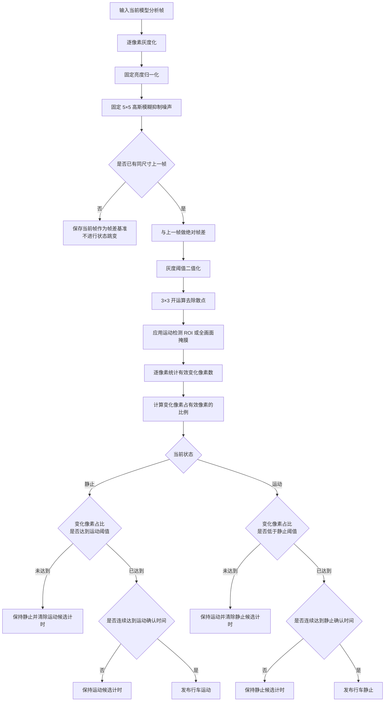
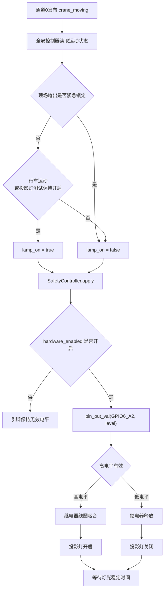
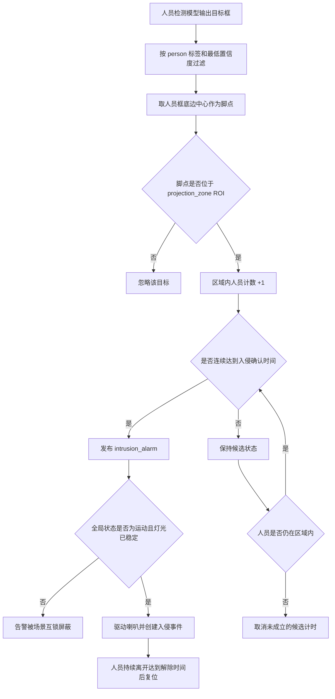
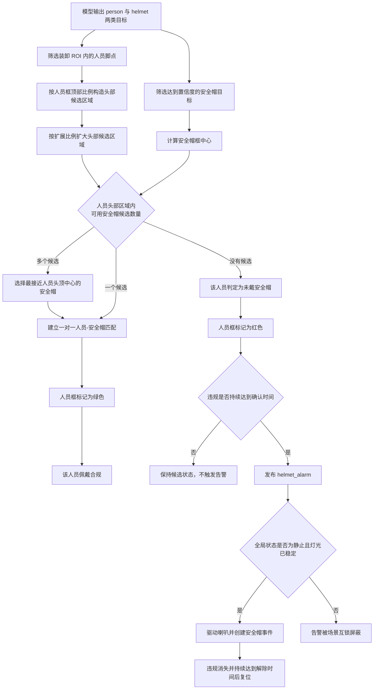
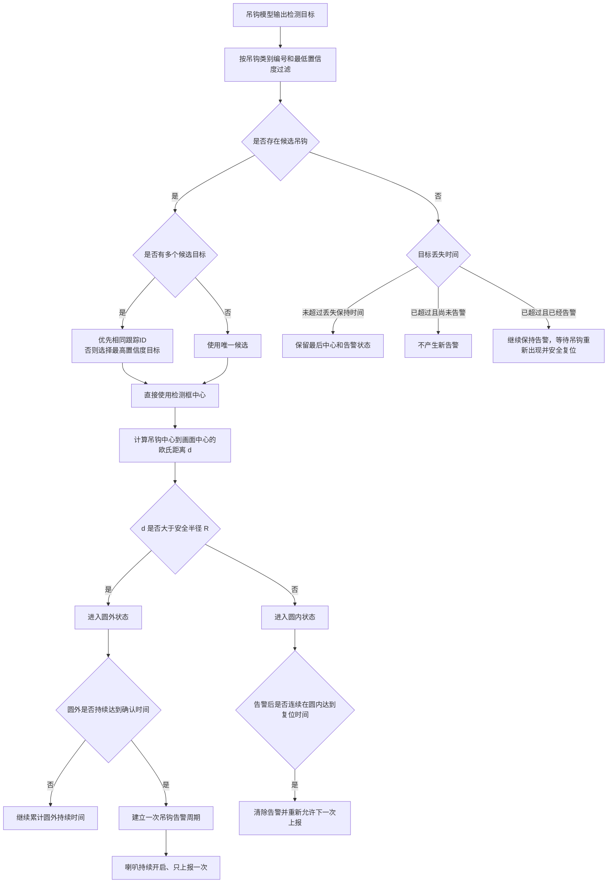
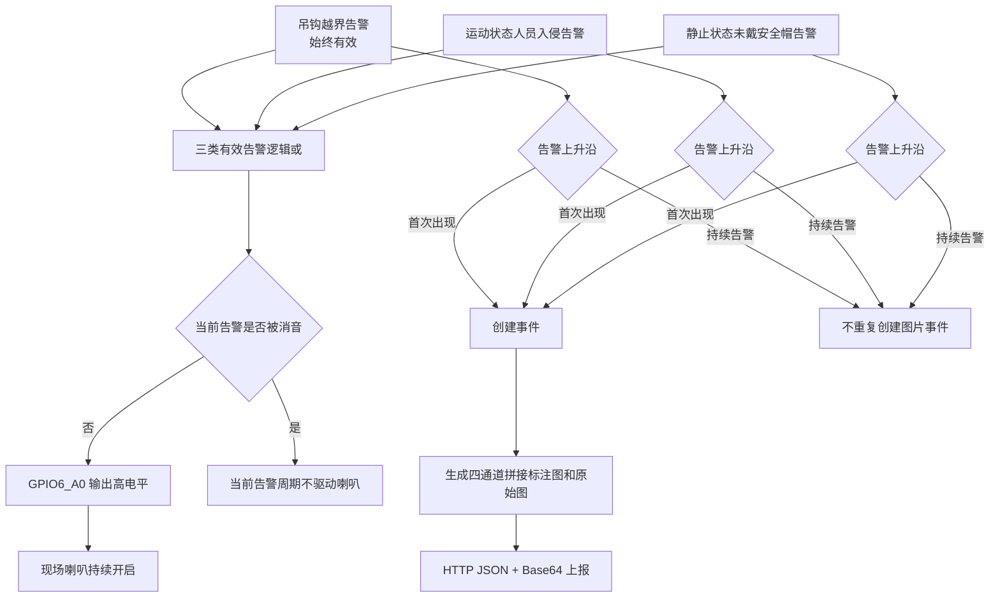
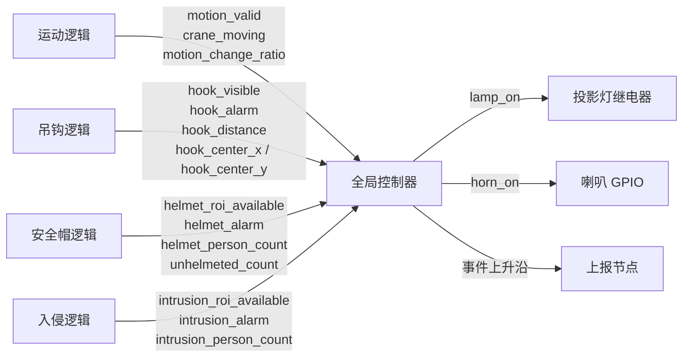
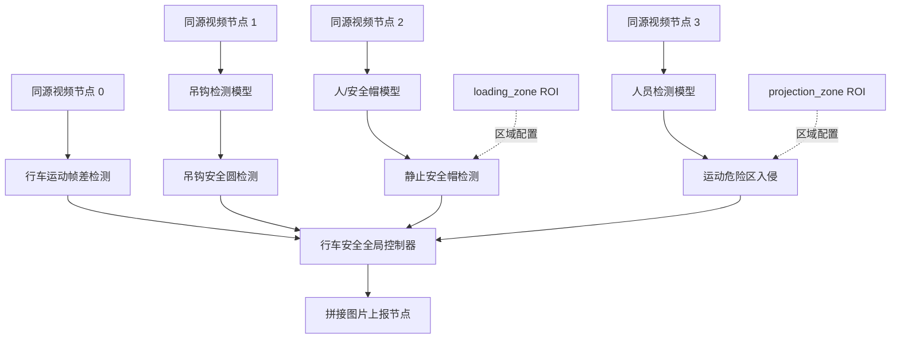

# 行车安全智能检测系统设计说明

> 文档版本：V1.2  
> 更新日期：2026-08-29  
> 实现平台：RK3588 视觉分析框架

## 1. 文档目的

本文档说明基于 RK3588 视觉分析平台设计的行车安全智能检测系统，包括总体架构、算法编排、现场硬件联动、告警上报、防抖与异常保持机制。文档面向企业技术汇报、方案评审和现场实施人员，重点回答以下问题：

1. 在没有行车 PLC 运动信号的条件下，系统如何仅通过视频判断行车处于运动还是静止状态。
2. 行车运动时，系统如何开启投影灯并检测投影危险区域内的人员入侵。
3. 行车静止时，系统如何判断装卸人员是否正确佩戴安全帽。
4. 系统如何利用吊钩位置实现歪拉斜吊风险的工程化检测。
5. 三类违规事件如何统一驱动现场喇叭，并形成去重后的图片告警记录。

## 2. 项目背景与需要解决的问题

行车作业同时存在设备运动、吊钩偏移、人员进入危险区域和个人防护用品佩戴不规范等风险。传统方案通常依赖人工观察、行车 PLC 信号或额外传感器，存在监控连续性不足、系统集成成本高、违规证据难以保留等问题。

本系统利用安装在行车吊钩正上方、随大车和小车一起移动但不随吊钩升降的固定摄像头，对同一视频源建立四个逻辑通道，并由一个全局控制器完成跨通道状态编排。设计重点解决以下问题：

| 现场问题 | 设计方法 | 形成的能力 |
| --- | --- | --- |
| 无法直接获得大车、小车运动信号 | 相邻帧逐像素帧差、有效变化像素占比和时间状态机 | 仅依靠视频精细判断行车运动或静止 |
| 行车运动时人员不应进入吊运危险区域 | 随车投影灯、固定画面 ROI、人员检测和脚点入区判断 | 对投影覆盖范围内的人员入侵进行告警 |
| 行车静止装卸时需要检查安全帽 | 人员框、头部候选区域和安全帽目标的一对一空间匹配 | 不需要单独训练“未戴安全帽”类别即可识别违规人员 |
| 无角度传感器，无法直接测量钢丝绳偏角 | 吊钩中心相对画面中心安全圆的偏移距离 | 将歪拉斜吊风险转化为可配置、可视化的像素越界判断 |
| 模型可能短时漏检、目标可能在边界抖动 | 持续时间确认、延迟解除和丢失保持 | 减少误报、重复上报和喇叭频繁启停 |
| 多类算法需要统一控制现场设备 | 全局逻辑汇总四通道状态，统一控制 GPIO 和继电器 | 实现检测、告警、灯光、消音、测试和上报闭环 |

## 3. 总体系统架构

总体设计采用“通道算法解耦、全局策略集中”的结构。四个通道分别完成单一职责，代码、参数和状态互不混合；全局控制器只接收通道发布的结构化结果，不重复执行图像推理。这种结构解决了多个检测场景互相影响、后续模型替换困难以及现场输出逻辑分散的问题。

四个逻辑通道的职责如下：

- 通道 0 发布行车运动状态和有效变化像素占比。
- 通道 1 无论行车运动或静止都检测吊钩，并发布吊钩可见性、中心位置、偏移距离和越界告警状态。
- 通道 2 持续计算人员与安全帽的匹配结果，但只有全局控制器确认行车静止且灯光稳定后，该告警才对现场输出生效。
- 通道 3 持续计算投影区域内的人数，但只有全局控制器确认行车运动且灯光稳定后，该告警才对现场输出生效。

该架构允许四路算法独立调参和单独查看效果，同时通过全局控制器保证“运动时检测入侵、静止时检测安全帽、吊钩始终检测”的业务规则不会发生冲突。

## 4. 场景状态编排

全局控制器根据通道 0 的 `crane_moving` 状态选择工作场景。状态由静止切换为运动时，控制器立即开启投影灯；状态由运动切换为静止时，控制器立即关闭投影灯。每次运动状态变化或继电器实际发生切换后，都重新计算灯光稳定等待时间 `lamp_settle_sec`。在该等待时间内，安全帽告警和人员入侵告警暂时不参与喇叭和上报，避免灯光突变造成的目标检测波动直接变成人员类告警。帧差运动算法本身不会在这段时间停止，它通过亮度归一化、运动/静止变化像素比例迟滞阈值和时间状态机抑制开关灯带来的瞬时影响。

四个通道算法在运行期间持续计算，全局控制器负责决定某一人员类告警在当前场景是否“有效”。这样无需在行车启停时频繁加载、卸载模型，场景稳定后可直接使用最新检测结果。

场景互锁关系如下：

| 系统状态 | 投影灯 | 吊钩检测 | 人员入侵告警 | 安全帽告警 |
| --- | --- | --- | --- | --- |
| 行车运动 | 开启 | 有效 | 有效 | 屏蔽 |
| 行车静止 | 关闭 | 有效 | 屏蔽 | 有效 |
| 灯光稳定等待期 | 正在切换或已切换 | 有效 | 屏蔽 | 屏蔽 |
| 投影灯手动测试且行车静止 | 手动开启 | 有效 | 屏蔽 | 屏蔽 |
| 紧急关闭现场输出 | 强制关闭 | 算法继续运行 | 不驱动硬件 | 不驱动硬件 |

## 5. 行车运动状态判断

### 5.1 算法流程

系统没有使用 PLC、编码器或限位开关判断大车和小车是否移动，而是使用相邻两帧的图像变化判断摄像头是否随行车发生了平面运动。主要处理步骤如下：

1. 直接使用通道的模型分析帧进行处理，不再额外缩小图像，也不再对画面划块。系统对分析帧中的每个有效像素逐一比较；当前画布通常使用 640×640 模型分析分辨率，因此这里的“逐像素”是指该分析分辨率上的全部像素。
2. 将图像逐像素转换为灰度图，固定使用直方图均衡化削弱整体亮度变化，并固定使用 5×5 高斯模糊减少传感器噪声、压缩噪声和细小纹理抖动。这两项属于内部预处理，不再提供现场配置入口。
3. 当前灰度图与上一帧的对应像素执行绝对差分，并使用 `diff_threshold` 将差分图二值化。灰度差超过阈值的像素被记为有效变化像素。
4. 对二值帧差图执行 3×3 形态学开运算，去除孤立噪点，避免单个噪声像素直接参与运动判定。
5. 如果配置了运动检测 ROI，则将 ROI 外像素清零；未配置时使用整幅分析画面。
6. 统计 ROI 内有效变化像素数量以及有效像素总数，计算变化像素占比，并只使用该占比驱动运动/静止状态机。

首帧或处理图像尺寸发生变化时，系统只保存当前预处理图像作为新的帧差基准，不会在没有可比上一帧时产生运动状态跳变。

有效变化像素比例定义为：

$$
R_{pixel}=\frac{N_{changed}}{N_{valid}}
$$

其中，$N_{changed}$ 为 ROI 内帧差超过阈值的像素数，$N_{valid}$ 为 ROI 内有效像素总数。

处于静止状态时，只有 $R_{pixel}$ 达到 `start_ratio` 并连续保持 `moving_confirm_sec`，系统才切换为运动。处于运动状态时，只有 $R_{pixel}$ 降到 `stop_ratio` 以下并连续保持 `still_confirm_sec`，系统才切换回静止。`start_ratio` 与 `stop_ratio` 分别设置，通常前者高于后者，从而在两个阈值之间形成迟滞区间。

进入运动与进入静止使用不同阈值，并分别设置持续确认时间，形成状态迟滞。这解决了行车启停瞬间、画面轻微振动或人员局部活动导致状态频繁跳变的问题。

### 5.2 可视化与调参

运动检测窗口同时常驻显示行车状态、实时有效变化像素百分比、运动/静止像素比例阈值、运动/静止实时累计确认时间及其设定阈值，以及帧差灰度阈值。高斯核固定为 5，亮度归一化固定开启，不再作为 Web 配置项或画面状态文字。二值帧差图中发生有效变化的每个像素都会以半透明橙色叠加到预览画面对应位置，不再显示分块边框。现场人员可以直接观察“具体哪些像素产生了有效帧差”和“当前变化像素占比为何达到或未达到状态阈值”，降低现场阈值调试对算法开发人员的依赖。

Web 按钮可循环选择并调整帧差灰度阈值、运动像素比例、静止像素比例以及运动/静止确认时间。全部参数始终可见，当前选择项只以黄色高亮表示它是增减按钮的操作目标。相邻帧基准会在首帧和图像尺寸变化时自动建立，不再提供手动重建按钮。

## 6. 投影灯控制与危险区域人员入侵检测

### 6.1 投影灯联动

投影灯由全局控制器统一控制。默认继电器控制引脚为 `GPIO6_A2`，有效电平为高电平。行车进入运动状态后，全局控制器通过 `SafetyController.apply()` 调用底层 `pin_out_val()`，将 `GPIO6_A2` 拉高，使继电器吸合并开启投影灯；行车进入静止状态后，将该引脚恢复为无效电平，继电器释放并关闭投影灯。

现场还提供投影灯测试开关。第一次点击后投影灯持续保持开启，第二次点击后退出测试并恢复自动行车状态控制，不再采用数秒后自动关闭的方式。紧急关闭按钮的优先级最高，会强制关闭喇叭和投影灯，并保持锁定，直到人工点击恢复自动控制。

### 6.2 人员入侵算法

危险区域不是使用固定地面坐标，而是在摄像头画面中配置名为 `projection_zone` 的多边形 ROI。摄像头和投影灯都安装在行车上并随行车移动，因此 ROI 相对于画面保持固定，也就随行车一起覆盖当前吊运区域，避免额外进行世界坐标标定或云台位置补偿。

人员检测逻辑按 `person` 标签和最低置信度筛选目标，取人员检测框底边中心作为人员脚点。只有脚点位于 `projection_zone` 多边形内，才认定该人员进入危险区域。使用脚点而不是检测框中心，可以减少人体上半身进入 ROI、但实际站立位置仍在边界外时产生的误判。

检测到区域内人员后，必须连续达到 `confirm_sec` 才建立入侵告警；人员离开后，必须连续达到 `clear_sec` 才解除告警。这一持续确认与延迟解除机制用于吸收模型的瞬时漏检和置信度波动。最终只有在“行车运动、投影灯稳定、ROI 有效”三个条件同时满足时，入侵告警才驱动现场喇叭和事件上报。

## 7. 静止装卸场景安全帽佩戴检测

安全帽模型只需要训练两类目标：`person` 和 `helmet`，不需要单独标注“未戴安全帽”。系统首先使用人员框底边中心判断人员是否位于装卸区域 `loading_zone`。对于区域内每个人员，根据人员框顶部的 `head_region_ratio` 构造头部候选区域，并按照 `match_margin_ratio` 向四周扩展，以容纳检测框误差、人体姿态变化和安全帽框偏移。

随后计算所有安全帽检测框的中心点。如果安全帽中心落入某个人员的头部候选区域，则认为它是该人员的候选安全帽；存在多个候选时，选择最接近人员头顶中心的一个。每个安全帽最多只能匹配一个人员，避免同一个安全帽被相邻人员重复使用。

匹配成功的人员框显示为绿色；没有匹配到安全帽的人员框显示为红色，并计入未戴安全帽人数。只要未戴安全帽人数大于零且持续达到违规确认时间，就发布 `helmet_alarm`；连续安全达到解除时间后才清除告警。

安全帽告警只在行车静止、投影灯关闭且画面经过稳定等待后参与现场控制。这样既符合静止装卸时人员集中作业的实际场景，也避免运动状态下的远距离人员、安全帽小目标和投影灯亮度变化造成无效报警。

## 8. 吊钩偏移与歪拉斜吊风险检测

### 8.1 能力定义

本方案不计算钢丝绳的真实空间角度，也不输出物理角度值。由于摄像头位于吊钩正上方，系统将吊钩检测框中心相对于画面中心的图像平面二维像素偏移作为歪拉斜吊风险的视觉代理量，并在画面中心设置可配置安全圆。吊钩中心持续超出安全圆时，认为存在歪拉斜吊风险。

该方法的优势是无需增加角度传感器、钢丝绳分割模型或相机三维标定；其边界是判断结果属于图像平面上的工程化风险判断，安全圆半径需要结合摄像头安装高度、视场角和现场允许偏移量进行标定。

### 8.2 算法与鲁棒状态机

吊钩目标由类别编号 `hook_class_id` 确认，不依赖模型名称或模型 ID。存在多个候选框时，系统按以下优先级选择当前吊钩：

1. 优先选择与上一帧相同跟踪 ID 的目标。
2. 没有相同跟踪 ID 时，选择置信度最高的目标重新建立跟踪。

系统直接使用当前吊钩检测框中心，不进行位置平滑或最大中心跳变过滤。吊钩中心与画面中心之间计算欧氏距离：

$$
d=\sqrt{(x_{hook}-x_{frame})^2+(y_{hook}-y_{frame})^2}
$$

安全判断直接使用单一半径：距离大于 `safe_radius` 为圆外，否则为圆内。边界附近的瞬时变化由圆外持续确认时间和圆内连续安全复位时间过滤。

吊钩连续位于圆外达到 `confirm_sec` 后，系统建立一次完整告警周期。告警建立后，即使吊钩短时间反复穿越边界，喇叭仍保持开启，事件图片不会重复上报。只有吊钩重新可见并连续位于安全圆内达到 `clear_sec`，告警周期才真正结束并重新允许下一次告警。

对于模型短时漏检，系统在 `lost_tolerance_sec` 内保留最后一次检测中心、圆内外状态和告警状态。画面中的丢失计时达到该时间后停止增长。超过保持时间后，如果尚未告警，则不会因为“看不见吊钩”产生新告警；如果告警已经建立，则丢失目标不能被误判为回到安全圆内，系统继续保持告警，直到重新看到吊钩并完成连续圆内复位。这一机制解决了目标遮挡、模型偶发漏检导致喇叭错误停止的问题。

吊钩检测不受行车运动/静止状态限制，始终参与全局告警。画面显示安全圆、偏移/半径、置信度/最低置信度，以及圆外确认、安全复位和丢失保持的“累计时间/配置时间”。

## 9. 现场喇叭、事件去重与告警上报

三类经过场景互锁后的有效告警进行逻辑或运算，任意一类成立就要求喇叭开启。默认喇叭引脚为 `GPIO6_A0`，高电平有效。全局控制器通过 `SafetyController.apply()` 和 `pin_out_val()` 将引脚拉高，从而控制现场喇叭。在自动模式且未开启喇叭测试时，全部有效告警都解除后，引脚才恢复为无效电平。

喇叭输出是“状态量”，事件上报是“边沿量”：

- 喇叭在有效违规持续期间一直保持开启，确保现场人员能够持续感知风险。
- 每类事件只在告警从无到有的上升沿创建一次，告警保持期间不重复上传图片。
- 违规解除并完成各自的安全复位时间后，系统重新进入待报警状态，下一次独立违规可再次上报。

这种设计解决了目标在边界附近抖动时服务器收到大量重复图片、但现场喇叭又不应过早停止的矛盾。

当前上报模板支持三种事件：吊钩超出安全圆、运动期间人员入侵、静止期间未戴安全帽。上报数据包括事件类型、事件 ID、抓拍时间、来源通道、行车运动状态、吊钩可见性/偏移距离或区域人数，并携带四通道拼接的标注图和原始图 Base64 数据。HTTP 接口模板使用 `POST /api/objectInvadeDet`。

## 10. GPIO 与人工控制策略

| 输出设备 | 默认端口 | 有效电平 | 自动开启条件 | 自动关闭条件 |
| --- | --- | --- | --- | --- |
| 投影灯继电器 | `GPIO6_A2` | 高电平 | 行车运动，或投影灯测试保持开启 | 行车静止且未处于测试状态 |
| 现场喇叭 | `GPIO6_A0` | 高电平 | 任一有效违规告警，或喇叭测试保持开启 | 全部有效违规解除且未处于测试状态 |

全局 Web 节点提供以下人工操作：

- **当前告警消音**：立即关闭当前告警周期的喇叭，不影响投影灯；全部有效违规解除后自动重新布防。
- **喇叭测试开关**：第一次点击持续开启，第二次点击关闭并恢复自动告警控制。
- **投影灯测试开关**：第一次点击持续开启，第二次点击关闭并恢复自动行车状态控制。
- **紧急关闭现场输出**：立即关闭喇叭和投影灯并保持人工锁定。
- **恢复自动控制**：解除紧急锁定、消音和测试保持状态，重新由四路算法控制现场设备。

如果 `hardware_enabled` 关闭，逻辑、画面和事件状态仍可用于调试，但硬件引脚保持无效电平。该设计便于在模型、ROI 和阈值尚未完成现场标定时安全联调。

## 11. 通道数据契约与全局组合关系

通道逻辑与全局逻辑之间只传递结构化状态，不传递算法内部对象。全局控制器通过配置的通道编号读取四路输入：运动通道 0、吊钩通道 1、安全帽通道 2、人员入侵通道 3。该数据契约使全局策略不依赖具体模型实现，后续替换人员模型、安全帽模型或吊钩模型时，只要通道输出保持一致，就不需要改动硬件控制和上报逻辑。

## 12. Web 画布编排

画布中应建立四个同源视频通道。运动通道不连接模型；吊钩、安全帽和入侵通道分别连接对应目标检测模型。安全帽通道必须绘制 `loading_zone`，入侵通道必须绘制 `projection_zone`。四个通道逻辑的全局输出全部连接到行车安全全局控制器，再由全局节点连接上报节点。

通道逻辑均提供运行时核心参数按钮。所有核心参数、实时检测结果以及确认/解除计时始终同时显示，不需要通过按钮逐项查看。参数切换后，当前选择项使用黄色显示；这只表示增减按钮当前操作的目标，其他信息仍保持显示。吊钩安全圆半径每次调整 5 像素，时间类参数每次调整 0.3 秒。运行时按钮适合现场快速标定，正式参数仍应在画布配置中保存，避免程序重启后恢复为配置值。

## 13. 关键参数与现场标定建议

| 模块 | 关键参数 | 作用 | 建议标定方法 |
| --- | --- | --- | --- |
| 运动检测 | `diff_threshold` | 单像素被认为发生变化的灰度阈值 | 先观察静止画面噪声，再逐步提高到静止噪声不再形成大面积橙色变化像素 |
| 运动检测 | `start_ratio` / `stop_ratio` | 进入运动和进入静止的全局变化比例 | 使用真实大车、小车启停视频分别记录变化比例，保留足够迟滞区间 |
| 运动检测 | `moving_confirm_sec` / `still_confirm_sec` | 状态切换持续确认 | 启动确认可较短，静止确认建议更长，以免减速过程过早进入装卸场景 |
| 吊钩检测 | `safe_radius` | 允许的吊钩图像平面偏移 | 在允许的最大实际偏移位置采集画面，将其换算为像素半径并留安全裕量 |
| 吊钩检测 | `confirm_sec` / `clear_sec` | 越界确认和连续安全复位 | 兼顾瞬时摆动过滤与风险响应速度，安全复位时间不宜过短 |
| 安全帽检测 | `head_region_ratio` | 人员框顶部作为头部区域的比例 | 用不同距离、弯腰和侧身样本检查安全帽中心是否仍落入头部区域 |
| 安全帽检测 | `match_margin_ratio` | 头部区域扩展量 | 过小容易漏匹配，过大可能把相邻人员的安全帽错误匹配 |
| 入侵检测 | `projection_zone` | 投影危险区域 | 按投影灯实际落地区域绘制，重点校准人员脚点所在边界 |
| 全局控制 | `lamp_settle_sec` | 开关灯后的画面稳定等待 | 根据投影灯响应时间、曝光调整时间和模型恢复稳定时间设置 |

## 14. 系统可靠性设计

本系统从以下层面提高现场运行稳定性：

1. **算法解耦**：四类检测各自独立，单个参数调整不会把其他业务代码混在一起。
2. **逐像素运动判断**：对分析画面中每个有效像素进行帧差比较，再由有效变化像素占比统一判断运动状态，避免粗粒度分块掩盖细小变化。
3. **双阈值与时间状态机**：运动/静止、越界/安全、违规/解除使用不同条件和持续时间，防止状态抖动。
4. **吊钩目标连续选择**：优先使用相同跟踪 ID，没有相同 ID 时选择置信度最高的吊钩目标。
5. **吊钩丢失保持**：短时漏检保留位置；已建立告警时，目标丢失不作为安全解除条件。
6. **人员事件延迟解除**：模型短时漏检不会立即关闭喇叭或结束事件周期。
7. **灯光切换互锁**：继电器切换后暂时屏蔽人员类告警，减少曝光突变误报。
8. **告警状态与上报边沿分离**：喇叭持续保持，但同一告警周期只上传一次图片。
9. **硬件安全优先级**：紧急关闭优先于自动逻辑和测试开关；硬件未启用时保持无效电平。
10. **现场可视化调参与统一文字缓存**：逐像素帧差蒙版、安全圆、吊钩目标中心、全部核心参数、实时检测值以及实时计时/设定阈值同时显示在视频窗口中。安全圆圆心到吊钩目标的连线不再绘制。普通文字和重影文字共用一个由布尔参数控制的绘制接口；底层采用线程独立 FreeType 实例、Unicode 单字形缓存、稳定整行 LRU、0/255 字形值归一化和局部包围框掩膜着色。固定文本整行复用，实时数字变化时仅重组已缓存字形，不会重新栅格化整行或污染整行缓存。
11. **底层异步分析调度**：非 NPU 通道统一由公共管线的单槽最新帧 worker 执行，GStreamer 解码回调只保留稳定帧引用并发布任务。即使新增传统 CV 逻辑计算量较大，也不会阻塞同源推理通道送帧；worker 落后时覆盖旧 pending 帧，保证实时性而不累积延迟。

## 15. 能力边界与实施注意事项

1. 行车运动状态完全由视频判断，没有与 PLC 速度、接触器或编码器信号进行交叉验证。强烈振动、大范围遮挡或极端光照变化可能影响帧差结果，应使用现场样本完成阈值标定。
2. 歪拉斜吊检测输出的是吊钩中心在图像平面上的偏移风险，不是真实钢丝绳空间角度。摄像头安装位置、镜头畸变和吊钩高度变化都会影响像素距离与实际距离的对应关系。
3. 吊钩不在画面中且尚未建立告警时，系统不会因为不可见而产生新的吊钩告警；如果告警已经建立，则必须重新看到吊钩并完成圆内连续安全复位才能解除。
4. 安全帽检测依赖人员框和安全帽框的检测质量。训练数据应覆盖俯视角度、不同人员尺度、遮挡、弯腰、背向和多人相邻场景。
5. 安全帽和入侵检测必须正确绘制 ROI。ROI 不存在或顶点不足三个时，相应通道会发布 ROI 无效状态，不应作为正式检测结果使用。
6. GPIO 引脚、电平和继电器接线必须在板端进行电气确认。驱动大功率喇叭或投影灯时应通过合适的继电器、隔离和保护电路，不应由 RK3588 GPIO 直接带载。
7. 当前设计按照需求不对视频断流执行额外现场动作。若企业安全规范要求断流故障告警，应在后续版本增加独立的设备健康状态和故障输出。
8. 当前 HTTP 上报模板中 `yuvWidth` / `yuvHeight` 常量为 1280×720，当前四宫格全局画布配置为 1280×1280。正式联调前应与接收方确认这两个字段是描述接口固定规格还是实际拼接图尺寸；如果描述实际图像，必须将模板常量与输出画布统一。
9. 人员与安全帽通道的业务逻辑已按 `person` / `helmet` 两类目标设计，但正式上线仍以现场数据训练、转换并验证后的 RKNN 模型为前置条件。验收时应覆盖俯视、小目标、遮挡和多人相邻样本，不能只验证通道逻辑而不验证模型。
10. 同源视频同时承载四个逻辑通道和三个模型推理通道。上线前应在目标分辨率、码率和并发配置下验证持续推理帧率、告警延迟和 RK3588 温度，确保算法时间阈值不会因算力不足而失真。

## 16. 建议验收场景

为了确认系统不仅“能检测”，而且能按企业现场规则完成联动，建议按下表完成验收：

| 验收场景 | 操作方式 | 预期结果 |
| --- | --- | --- |
| 系统启动且行车静止 | 保持画面稳定 | 投影灯保持关闭；稳定时间结束后安全帽场景有效 |
| 局部人员活动 | 行车不动，人员在局部区域走动 | 可出现局部橙色变化像素；其占比未达到运动阈值或未持续到确认时间时，系统保持静止 |
| 大车或小车启动 | 完成一次正常启动 | 有效变化像素占比达到阈值并经过确认时间后发布运动，`GPIO6_A2` 拉高、继电器吸合、投影灯开启 |
| 运动期间人员入侵 | 人员脚点进入 `projection_zone` 并持续超过确认时间 | 稳定期结束后建立入侵告警，`GPIO6_A0` 拉高，同一告警周期只上报一次 |
| 行车减速并停止 | 完成一次正常停车 | 变化量持续达到静止条件后发布静止，`GPIO6_A2` 恢复无效电平，稳定期内不启用人员类告警 |
| 静止期间未戴安全帽 | `loading_zone` 内人员头部没有匹配到安全帽 | 违规持续超过确认时间后建立安全帽告警，人员框标红，喇叭开启并上报一次 |
| 吊钩短时越界 | 吊钩越过安全圆但未达确认时间 | 显示越界确认中，不建立正式告警 |
| 吊钩持续越界并反复穿越边界 | 越界超过确认时间，随后在圆边缘摆动 | 喇叭持续开启，不重复上报；只有连续圆内安全达到复位时间才解除 |
| 吊钩告警期间漏检 | 在已建立吊钩告警后遮挡吊钩 | 漏检不被当作恢复安全，喇叭保持，直到吊钩重新可见并完成圆内复位 |
| 硬件测试和紧急关闭 | 分别操作喇叭、投影灯测试开关和紧急关闭 | 测试按钮第一次开启并保持、第二次恢复；紧急关闭强制两路输出无效，直到点击恢复自动控制 |

## 17. 预期应用效果

该系统将原本相互独立的行车运动判断、吊钩偏移、人员入侵、安全帽佩戴、现场喇叭和投影灯控制整合为一个闭环：系统能够根据行车状态主动切换检测场景，持续监测吊钩风险，在违规发生时立即产生现场告警，并保留一次清晰、可追溯的四路拼接图片证据。

与单一模型直接报警相比，本设计的核心价值不只是“检测到目标”，而是通过状态机、场景互锁、空间关系匹配、丢失保持和事件去重，把视觉识别结果转化为能够在企业现场长期运行的安全控制逻辑。
