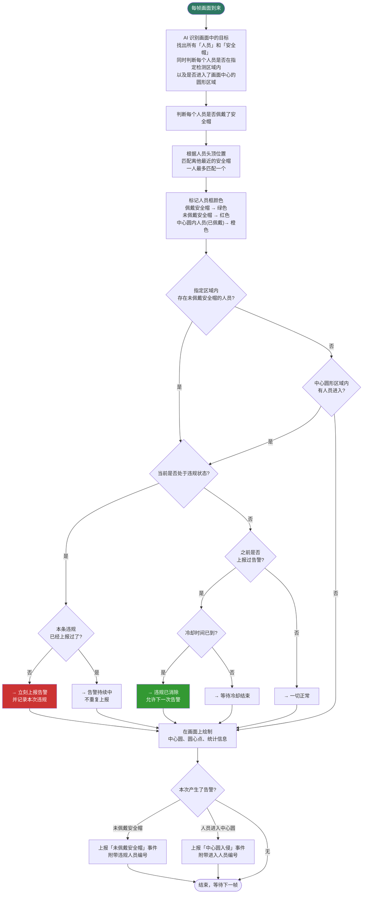

```mermaid
flowchart TD
    START(["每帧画面到来"]) --> CLASSIFY["AI 识别画面中的目标<br/>找出所有「人员」和「安全帽」<br/>同时判断每个人员是否在指定检测区域内<br/>以及是否进入了画面中心的圆形区域"]

    CLASSIFY --> MATCH["判断每个人员是否佩戴了安全帽"]
    MATCH --> MATCH_DETAIL["根据人员头顶位置<br/>匹配离他最近的安全帽<br/>一人最多匹配一个"]

    MATCH_DETAIL --> COLOR["标记人员框颜色<br/>佩戴安全帽 → 绿色<br/>未佩戴安全帽 → 红色<br/>中心圆内人员(已佩戴)→ 橙色"]

    COLOR --> NH{"指定区域内<br/>存在未佩戴安全帽的人员?"}
    NH -->|是| CHECK{"当前是否处于违规状态?"}
    NH -->|否| CI{"中心圆形区域内<br/>有人员进入?"}

    CI -->|是| CHECK
    CI -->|否| DRAW

    CHECK -->|是| ALREADY{"本条违规<br/>已经上报过了?"}
    ALREADY -->|否| FIRE["→ 立刻上报告警<br/>并记录本次违规"]
    ALREADY -->|是| HOLD["→ 告警持续中<br/>不重复上报"]
    CHECK -->|否| WAS_SET{"之前是否<br/>上报过告警?"}
    WAS_SET -->|是| COOL{"冷却时间已到?"}
    COOL -->|是| RST["→ 违规已消除<br/>允许下一次告警"]
    COOL -->|否| WAIT["→ 等待冷却结束"]
    WAS_SET -->|否| IDLE["→ 一切正常"]

    FIRE --> DRAW
    HOLD --> DRAW
    RST --> DRAW
    WAIT --> DRAW
    IDLE --> DRAW

    DRAW["在画面上绘制<br/>中心圆、圆心点、统计信息"]
    DRAW --> REPORT{"本次产生了告警?"}
    REPORT -->|未佩戴安全帽| SEND1["上报「未佩戴安全帽」事件<br/>附带违规人员编号"]
    REPORT -->|人员进入中心圆| SEND2["上报「中心圆入侵」事件<br/>附带进入人员编号"]
    REPORT -->|无| END0(["结束，等待下一帧"])
    SEND1 --> END0
    SEND2 --> END0

    style START fill:#2d7862,color:#fff
    style FIRE fill:#c33,color:#fff
    style RST fill:#393,color:#fff
```
