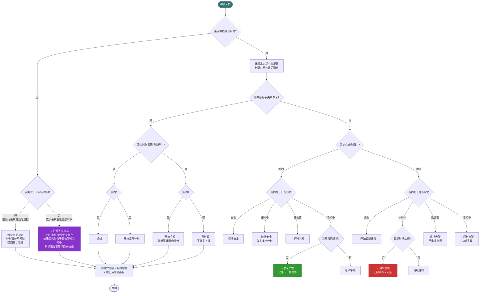

```mermaid
flowchart TD
    START(["每帧入口"]) --> FIND{"画面中检测到吊钩?"}

    FIND -->|否| LOSS{"丢失时长 &ge; 容忍时间?"}
    LOSS -->|否<br/>刚开始丢失或短时遮挡| FREEZE["维持当前状态<br/>计时暂停不累加<br/>画面数字冻结"]
    LOSS -->|是<br/>连续丢失超过容忍时间| LOST["→ 目标丢失状态<br/>计时清零, 安全圈变紫色<br/>如果丢失时处于已告警或冷却中<br/>则标记告警周期尚未结束"]
    FREEZE --> DRAW
    LOST --> DRAW

    FIND -->|是| POS["计算吊钩距中心距离<br/>判断在圈内还是圈外"]
    POS --> RECOVER{"刚从目标丢失中恢复?"}
    RECOVER -->|否| SM

    RECOVER -->|是| AL{"丢失时告警周期进行中?"}
    AL -->|否| RNEW{"圈内?"}
    RNEW -->|是| R1["→ 安全"]
    RNEW -->|否| R2["→ 开始超限计时"]
    AL -->|是| RA{"圈内?"}
    RA -->|是| R3["→ 开始冷却<br/>重新累计圈内时长"]
    RA -->|否| R4["→ 已告警<br/>不重复上报"]
    R1 --> DRAW
    R2 --> DRAW
    R3 --> DRAW
    R4 --> DRAW

    SM{"吊钩在安全圈内?"}
    SM -->|圈内| IN{"当前处于什么状态"}
    IN -->|安全| IN0["保持安全"]
    IN -->|计时中| IN1["→ 恢复安全<br/>取消本次计时"]
    IN -->|已告警| IN2["→ 开始冷却"]
    IN -->|冷却中| IN3{"冷却时间达标?"}
    IN3 -->|是| IN3Y["→ 恢复安全<br/>允许下一轮告警"]
    IN3 -->|否| IN3N["继续冷却"]

    SM -->|圈外| OUT{"当前处于什么状态"}
    OUT -->|安全| OUT0["→ 开始超限计时"]
    OUT -->|计时中| OUT1{"超限时间达标?"}
    OUT1 -->|是| OUT1Y["→ 触发告警<br/>上报事件 + 截图"]
    OUT1 -->|否| OUT1N["继续计时"]
    OUT -->|已告警| OUT2["保持告警<br/>不重复上报"]
    OUT -->|冷却中| OUT3["→ 回到告警<br/>冷却清零"]

    DRAW["绘制安全圈 + 吊钩位置<br/>+ 右上角信息面板"]
    DRAW --> END(["返回"])

    style START fill:#2d7862,color:#fff
    style OUT1Y fill:#c33,color:#fff
    style IN3Y fill:#393,color:#fff
    style LOST fill:#83c,color:#fff
```
